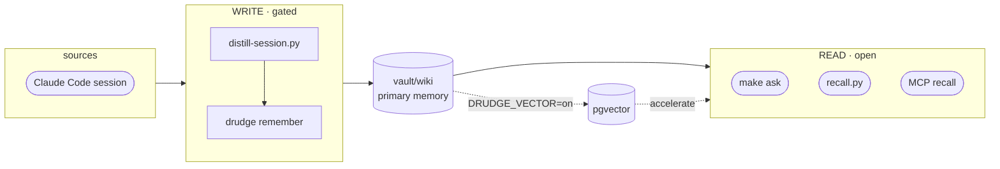

# oh-my-boring

[English](README.md) · [한국어](README.ko.md) · **日本語**

[](https://github.com/jazz1x/oh-my-boring/actions/workflows/ci.yml)


**セルフホスティング型パーソナルメモリ RAG。** Claude Code のセッションがローカルで人が読める wiki に蒸留され、*"前これどうやったっけ？"* を呼び出して使います。**クラウド 0 · 100% ローカル。**

```bash
git clone https://github.com/jazz1x/oh-my-boring.git ~/oh-my-boring
cd ~/oh-my-boring
make up
make ask Q="docker build cache の問題、どう直したっけ？"
```

> **Docker**、**Ollama**（または OpenAI-compatible サーバー）、**Python 3**、**jq**、**curl** が必要です。

---

## 機能

1. **自動蓄積** — セッション終了時に `vault/wiki` に整理されたマークダウンノートとして保存。手動管理不要。
2. **マークダウン中心のメモリ** — プレーンテキストで人に優しく、git diff 可能。検索もマークダウンを直接読みます。
3. **ローカル専用** — 埋め込みと要約が Ollama などローカル LLM で実行。外部 API やトークン不要。

オプションの **pgvector** アクセラレータ（`DRUDGE_VECTOR=on`）を有効にすると、類似度検索 + GraphRAG が追加されます。

---

## アーキテクチャ



- **Read door** — 高速、LLM 不要。`make ask`、`recall.py`、MCP `recall` が `vault/wiki` を直接読みます。
- **Write door** — gated。`distill-session.py` がローカル LLM を呼び出し、drudge の `remember` MCP tool で書き込みます。

---

## 設定

ポリシーは **`boring.json`**（`make up` で `boring.example.json` から生成）に記述します：

```json
{
  "$schema": "https://raw.githubusercontent.com/jazz1x/oh-my-boring/main/boring.schema.json",
  "schema_version": 1,
  "note_lang": "auto",
  "repos": [
    {"match": "your-company", "origin": "company", "name": "your-company"},
    {"match": "~/code", "origin": "personal", "name": "mine"}
  ],
  "agents": [
    {"id": "claude-code", "enabled": true, "format": "claude-json", "paths": ["~/.claude/projects"]}
  ]
}
```

| Key | 用途 |
|---|---|
| `note_lang` | `auto` · `ko` · `en` |
| `repos[]` | パス/remote ルール → `origin=personal/company/mirror/community` |
| `agents[]` | vector mode の ingest source |

シークレット/ランタイムスイッチは **`.env`**：

| Variable | 用途 |
|---|---|
| `DRUDGE_VECTOR` | `on` で pgvector 有効化（オプション） |
| `DRUDGE_LLM_BASE_URL` | OpenAI-compatible endpoint、デフォルト `http://localhost:11434/v1` |
| `DRUDGE_LLM_MODEL` / `DRUDGE_EMBED_MODEL` | デフォルト `gemma4:12b` / `bge-m3` |
| `SLACK_APP_TOKEN` / `SLACK_BOT_TOKEN` | オプション Slack assistant |

---

## コマンド

| Command | 説明 |
|---|---|
| `make up` | drudge 起動（hermes-agent イメージがある場合のみ一緒に起動） |
| `make ollama` | Ollama 実行確認（必要ならバックグラウンド起動） |
| `make ask Q="..."` | recall + 要約を一度に実行 |
| `make sync` | vault の再取り込み |
| `make remember M="text"` | 1 行ノートを書き込み |
| `make collect [N=1]` | 過去セッションの lazy バックフィル |
| `make hermes-build` | オプション hermes-agent イメージの clone/build |
| `make smoke` | end-to-end smoke test |
| `make logs` | drudge ログ |
| `make guard` | fmt + clippy + test + Python py-compile |
| `make down` | コンテナ停止 |

---

## エージェントアダプター

`agents/` は外部エージェントを drudge エンジンに接続する **ホスト側アダプター** です。すべてのアダプターは同じ MCP/HTTP インターフェースを通じて drudge と通信し、いずれも必須ではありません。

旧 `hooks/` パスは backward-compatible な symlink セットとして残っているため、既存の Claude Code `settings.json` エントリや cron job は壊れません。

| アダプター | パス | 消費主体 | エントリポイント | 役割 |
|---|---|---|---|---|
| Claude Code | `agents/claude-code/distill-session.py` | `SessionEnd` / `Stop` hook | セッションを要約し `remember` を呼び出す |
| Claude Code | `agents/claude-code/recall.py` | `UserPromptSubmit` hook | 関連 snippet を取得しプロンプト context に注入 |
| hermes-agent | `agents/hermes/ingest-worker.py` | `hermes cron --script` | cron tick ごとに 1 セッションずつバックフィル |
| scheduler | `agents/schedulers/collect-sessions.py` | cron / launchd / 手動 | 古いセッションの lazy バックフィル |
| shared | `agents/shared/boring_config.py` | アダプター import | `boring.json` ポリシーローダー |

### トークン予算

自動検索はエージェントの context window を爆発させる可能性があるため、検索面は予算を意識しています。

- MCP `recall` は `max_tokens`、`max_results` を受け取ります。
- HTTP `/search` は `max_tokens`、`max_results` を受け取ります。
- `recall.py` は `RECALL_MAX_TOKENS` / `RECALL_MAX_RESULTS` で注入 context を制限します。
- `ask`/`brief` 合成は取得した context を固定文字数上限以下に保ちます。

### その他のエージェント

MCP に対応したエージェントならどれも drudge を利用できます。この repo は Claude Code、Cursor、Windsurf、Claude Desktop がすべて読み込む標準の **`.mcp.json`**（root key `mcpServers`）を同梱しています:

```json
{ "mcpServers": { "drudge": { "type": "http", "url": "http://localhost:7700/mcp" } } }
```

（VS Code Copilot は root key `servers` を使う `.vscode/mcp.json` を使用します。CLI 代替: `claude mcp add --transport http --scope project drudge http://localhost:7700/mcp`。compose の sibling コンテナは `http://drudge:7700/mcp` でアクセスします。）

利用可能な tools（10個）: `recall` · `neighbors` · `claims`（検索）· `ask` · `brief`（生成 — LLM 実行）· `corpus_status` · `config_get`（introspection）· `remember` · `classify_repo` · `sync`（書き込み / メンテナンス）。

デフォルトの wiki-first モード（`DRUDGE_VECTOR=off`）では、4 つの tool が pgvector バックエンドを必要とし、`DRUDGE_VECTOR=on` を設定するまで JSON-RPC `-32603` を返します: `neighbors`、`claims`、`corpus_status`、`brief`。残りの 6 つ（`recall`、`ask`、`remember`、`sync`、`config_get`、`classify_repo`）は `vault/wiki` を直接使用します。

MCP 呼び出し例（HTTP 上の raw JSON-RPC）:

```bash
curl -s -X POST http://localhost:7700/mcp \
  -H 'content-type: application/json' \
  -d '{
    "jsonrpc": "2.0",
    "id": 1,
    "method": "tools/call",
    "params": {
      "name": "recall",
      "arguments": {
        "query": "docker build cache fix",
        "max_tokens": 1500,
        "max_results": 3
      }
    }
  }' | jq .
```

### オプション: hermes-agent

[hermes-agent](https://hermes-agent.org) はサードパーティの自律 supervisor です。Slack、オーケストレーション、cron ベースのバックフィルを drudge の MCP バックエンド経由で動かせます。イメージを別途ビルドすれば `make up` が自動的に検出します。

---

## デプロイ

| Mode | 方法 |
|---|---|
| **Docker**（デフォルト） | `make up` |
| **Native** | `cd drudge && DRUDGE_VAULT_DIR="$PWD/../vault" DRUDGE_HTTP_ADDR=127.0.0.1:7700 cargo run --release -- serve` |

> Native `serve` は `DRUDGE_VAULT_DIR` が必要です — 設定しないと `remember` が `DRUDGE_VAULT_DIR not set` で失敗します。またデフォルトで `0.0.0.0:7700` にバインドするため、loopback のみに限定するには `DRUDGE_HTTP_ADDR=127.0.0.1:7700` を設定してください。

---

## 開発 · ガードレール

- SSOT ドキュメント: `drudge/{PHILOSOPHY,RUST-STYLE,ENFORCEMENT}.md`
- `make guard` = `rustfmt --check` + `clippy -D warnings` + `cargo test`
- CI: `rust-gate` · `gitleaks` · `cargo-deny` · `trivy`
- `unsafe_code = "forbid"`

---

## トラブルシューティング

| 症状 | 解決 |
|---|---|
| `make up` 失敗 | Ollama を確認: `curl -sf http://127.0.0.1:11434/api/tags` |
| ポート競合 | `lsof -i :7700 -i :5432 -i :11434` |
| 2 回目の `make up` / 再クローン失敗 | まず `make down` を実行してください — コンテナ名が固定で `127.0.0.1:7700` / `:5432` にバインドするため、2 つ目のスタックが実行中のスタックと競合します |
| agent が起動しない | `OMB_CORE_ONLY=1 make up` で core-only 実行。hermes イメージは別途ビルドが必要 |

---

## Ollama を常時起動しておく

`make up` は Ollama が起動していない場合は起動しますが、後から停止すると次のセッション取り込みが失敗します。

- 確認/起動: `make ollama`
- 再起動後も維持 (macOS):
  ```bash
  brew services start ollama
  ```
- または永続ターミナルで: `ollama serve`

## 定期的な sync

drudge は 4 時間ごとに deterministic sync をスケジュールしますが、`vault/wiki/` を手動で編集したり、vector/graph データをより頻繁に最新化したい場合は:

```bash
make sync
```

自動 sync には cron を追加:

```bash
# 毎時
0 * * * * cd ~/oh-my-boring && make sync >/tmp/omb-sync.log 2>&1
```

---

## ディレクトリ

```text
oh-my-boring/
├─ drudge/                  # Rust エンジン
├─ agents/                  # ホスト側エージェントアダプター
│  ├─ claude-code/          # Claude Code hooks
│  ├─ hermes/               # hermes-agent cron
│  ├─ schedulers/           # cron/launchd バックフィル
│  └─ shared/               # ポリシー/設定ライブラリ
├─ hooks/                   # backward-compatible symlink → agents/
├─ scripts/                 # guard.sh · smoke.sh
├─ vault/                   # raw → wiki メモリ
├─ data/                    # Postgres データ (gitignored)
├─ docker-compose.yml
├─ start.sh
├─ boring.json              # ポリシー (make up 時に生成)
└─ Makefile
```

> **vault/wiki ID について:** `wiki-0000.md` は repo に含まれるサンプルノートです。個人ノートは `wiki-0001.md` から始まり gitignore されているため、private な内容が git に混ざることはありません。
>
> **プラットフォームについて:** macOS と Linux でテストされています。`hooks/` が backward-compatible な symlink を使用しているため、Windows はまだ公式にサポートされていません。
