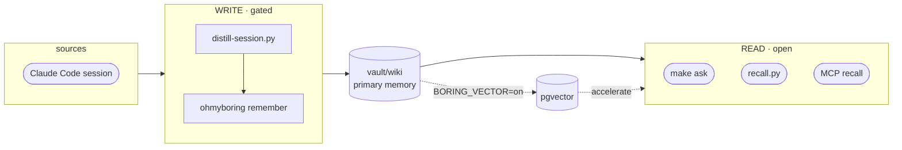

# ohmyboring

[English](README.md) · [한국어](README.ko.md) · **日本語**

[](https://github.com/jazz1x/ohmyboring/actions/workflows/ci.yml)

[](LICENSE)


**セルフホスティング型パーソナルメモリ RAG。** Claude Code / Kimi Code のセッションがローカルで人が読める wiki に蒸留され、*"前これどうやったっけ？"* を呼び出して使います。**クラウド 0 · 100% ローカル。**

```bash
# 最速 — ワンライナー: ~/oh-my-boring にクローン、ビルド、Claude Code フックまで連携。
sh -c "$(curl -fsSL https://raw.githubusercontent.com/jazz1x/ohmyboring/main/install.sh)"
```

または手動で:

```bash
git clone https://github.com/jazz1x/ohmyboring.git ~/oh-my-boring
cd ~/oh-my-boring
make up
make collect N=20   # 過去の Claude Code セッションで vault を埋める（新規クローンは空）
make ask Q="docker build cache の問題、どう直したっけ？"
```

> 新規クローンは **vault が空** なので、初日の `make ask` は何も見つけられません。`make collect` で過去の記録を埋めれば、以降は各セッションが自動で蓄積されます（[取り込み](#取り込み-ingestion)参照）。

> **Docker**、**Ollama**（または OpenAI-compatible サーバー）、**Python 3**、**jq**、**curl**、**git**、**make** が必要です。

---

## 機能

1. **自動蓄積** — セッション終了時に `vault/wiki` に整理されたマークダウンノートとして保存。手動管理不要。
2. **マークダウン中心のメモリ** — プレーンテキストで人に優しく、git diff 可能。検索もマークダウンを直接読みます。
3. **ローカル専用** — 埋め込みと要約が Ollama などローカル LLM で実行。外部 API やトークン不要。

オプションの **pgvector** アクセラレータ（`BORING_VECTOR=on`）を有効にすると、類似度検索 + GraphRAG が追加されます。

---

## 取り込み (ingestion)

メモリの入り口は 3 つ — セットアップ後、最初の 2 つはほとんど触りません：

| 方法 | コマンド | タイミング |
| --- | --- | --- |
| **自動（セッション終了時）** | SessionEnd フック（`install.sh` が設定） | すべての Claude Code / Kimi セッション — `hooks/distill-session.py` がトランスクリプトを蒸留し `remember` します。対になる `UserPromptSubmit` フック（`recall.py`）が関連する過去のメモリを新しいプロンプトへ自動注入します。 |
| **過去セッションのバックフィル** | `make collect [N=20]` | インストール直後、空の vault を `~/.claude/projects` の履歴で埋めるとき。新しい順・冪等（セッションごとのマーカーで蒸留済みはスキップ）、1 回に `N` 件だけ処理し CPU を占有しません。 |
| **今すぐ（セッションを終えずに）** | `make distill-now` · `make remember M="…"` | セッションを終了せずに即座に取り込みたいとき。`distill-now` は**現在の**トランスクリプトをその都度再蒸留し、マーカーを残さないため、セッション終了時の通常の取り込みもそのまま動作します（初期ノート + 最終ノートの両方ができる場合あり）。`remember` は自分で書いたノートを保存します。 |

### フックを手動で設定

`install.sh` が自動で行います。やり直す場合（または `BORING_WIRE=0` で実行した場合）：

```bash
python3 agents/shared/agent_wiring.py --install \
  --boring-home ~/oh-my-boring --server-name ohmyboring \
  --server-url http://localhost:7700/mcp
```

または `~/.claude/settings.json` を手で編集：`python3 ~/oh-my-boring/hooks/distill-session.py` を実行する `SessionEnd` フックと、`recall.py` を実行する `UserPromptSubmit` フックを追加します。

---

## メモリを見る

ノートはただのマークダウンなので、**`vault/` フォルダを [Obsidian](https://obsidian.md) のvault（保管庫）として開く** だけで、グラフビュー・バックリンク・タグ・全文検索がそのまま使えます。コンパイル済みノートには Obsidian-safe な `tags` と `[[wiki-NNNN]]` の `relates_to` リンクが既に入っているため、グラフビューがメモリのつながりをそのまま描画します（`BORING_VECTOR=on` のとき GraphRAG グラフがこのリンクに投影され最も豊かになります）。専用 UI を作る必要はありません。Obsidian が作る `.obsidian/` ワークスペースフォルダは gitignore されているので、レイアウトはローカルに留まり git に漏れません。

---

## アーキテクチャ



- **Read door** — 高速、LLM 不要。`make ask`、`recall.py`、MCP `recall` が `vault/wiki` を直接読みます。
- **Write door** — gated。`distill-session.py` がローカル LLM を呼び出し、ohmyboring の `remember` MCP tool で書き込みます。

---

## 設定

ポリシーは **`boring.json`**（`make up` で `boring.example.json` から生成）に記述します：

```json
{
  "$schema": "https://raw.githubusercontent.com/jazz1x/ohmyboring/main/boring.schema.json",
  "schema_version": 2,
  "note_lang": "auto",
  "llm": {
    "provider": "ollama",
    "base_url": "http://host.docker.internal:11434/v1",
    "model": "gemma4:12b",
    "embed_model": "bge-m3",
    "embed_dim": 1024,
    "api_key_env": "BORING_LLM_API_KEY",
    "bootstrap": "auto"
  },
  "repos": [
    {"match": "your-company", "origin": "company", "name": "your-company"},
    {"match": "~/code", "origin": "personal", "name": "mine"}
  ],
  "agents": [
    {"id": "claude-code", "enabled": true, "format": "claude-json", "paths": ["~/.claude/projects"]}
  ]
}
```

| Key | 用途 |
|---|---|
| `note_lang` | `auto` · `ko` · `en` |
| `llm.provider` | `ollama`（モデル pull）· `lmstudio`（アプリでロード、pull なし）· `openai-compatible`（vLLM / llama.cpp / リモート） |
| `llm.base_url` / `llm.model` | OpenAI-compatible `/v1` エンドポイント + 合成モデル |
| `llm.embed_model` / `llm.embed_dim` | 埋め込みモデル + そのベクトル次元（カーネル唯一のモデル） |
| `llm.bootstrap` | `auto` = ブートストラップが起動/pull 可能 · `manual` = ヘルスチェックのみ（サーバーはユーザー所有） |
| `repos[]` | パス/remote ルール → `origin=personal/company/mirror/community` |
| `agents[]` | vector mode の ingest source |

**LLM バックエンドの切り替え**は config ブロック 1 つで完結します。LM Studio: `"provider": "lmstudio"`、`"base_url": "http://host.docker.internal:1234/v1"`、`"bootstrap": "manual"` とし、LM Studio アプリでモデルをロードしてから `make up`。`make up` は `scripts/llm-providers/<provider>.sh` にディスパッチして適切なブートストラップ（Ollama pull か LM Studio ヘルスチェック）を行います。

`.env` はシークレット + ランタイムオーバーライド専用になりました：

| Variable | 用途 |
|---|---|
| `BORING_VECTOR` | `on` で pgvector 有効化（オプション） |
| `BORING_LLM_BASE_URL` / `BORING_LLM_MODEL` | `llm.base_url` / `llm.model` のランタイムオーバーライド（オプション）。`drudge` バイナリをホストで直接実行する場合は `BORING_LLM_BASE_URL=http://localhost:11434/v1` を設定 |
| `BORING_LLM_API_KEY` | `llm.api_key_env` がここを指す場合の API キー（認証 provider） |
| `SLACK_APP_TOKEN` / `SLACK_BOT_TOKEN` | オプション Slack assistant |

> **埋め込みモデルを変えるとベクトルの次元が変わります。** 合成モデル（`llm.model`）は自由に差し替えられますが、`llm.embed_model` を変えるとサイズの異なるベクトルが出力されるため、`llm.embed_dim` を一致させ、**かつ** `make reset` を実行する必要があります — そうしないと旧形状のベクトルへの upsert が失敗します。よくある次元: `bge-m3` = 1024 · OpenAI `text-embedding-3-small` = 1536 · `nomic-embed-text` = 768。

### ネーミング階層

階層ごとに名前は 1 つ — `ohmyzsh` ↔ `~/.oh-my-zsh` パターン。対象ではなく階層が変わります：

| 階層 | 名前 | 登場箇所 |
|---|---|---|
| ブランド / repo / MCP サーバー | `ohmyboring` | repo URL, `.mcp.json`, `--server-name` |
| インストールディレクトリ / compose プロジェクト | `~/oh-my-boring` | clone パス, `BORING_HOME`, compose プロジェクト名 |
| エンジンパッケージ / バイナリ | `drudge` | `Cargo.toml`, ソース, `drudge` CLI |
| コンテナ | `boring-*` | `boring-drudge` · `boring-postgres` · `boring-agent` |
| 環境変数 prefix | `BORING_*` | `BORING_VECTOR` · `BORING_URL` · `BORING_LLM_*` · `BORING_VAULT_DIR` · `BORING_HOME` |

---

## コマンド

| Command | 説明 |
|---|---|
| `make up` | ohmyboring エンジン起動（hermes-agent イメージがある場合のみ一緒に起動） |
| `make ollama` | Ollama 実行確認（必要ならバックグラウンド起動） |
| `make ask Q="..."` | recall + 要約を一度に実行 |
| `make sync` | vault の再取り込み |
| `make remember M="text"` | 1 行ノートを書き込み |
| `make collect [N=1]` | 過去 Claude Code セッションの lazy バックフィル |
| `make collect-kimi [N=1]` | 過去 Kimi Code セッションの lazy バックフィル |
| `make hermes-build` | オプション hermes-agent イメージの clone/build |
| `make smoke` | end-to-end smoke test |
| `make logs` | エンジンログ |
| `make guard` | fmt + clippy + test + Python py-compile |
| `make quality` | リリース受け入れ drift ゲート |
| `make down` | コンテナ停止 |

---

## 使用例

### サポートされているエージェントをすべてバックフィル

```bash
# Claude Code（デフォルトの make collect）
make collect N=20

# Kimi Code
make collect-kimi N=20

# GitHub Codex
COLLECT_LIMIT=20 python3 agents/codex/collect-sessions.py
```

### 日次/週次の消費

```bash
# セッション開始用の構造化コンテキストカード（BORING_VECTOR=off でも動作）
curl -s -X POST http://localhost:7700/context \
  -H 'content-type: application/json' \
  -d '{"project":"omb","max_items":5}' | jq .

# 週次ブリーフィング（BORING_VECTOR=on が必要）
curl -s -X POST http://localhost:7700/weekly \
  -H 'content-type: application/json' \
  -d '{"project":"omb"}' | jq .

# Stalled register — 7日以上動いていない項目（BORING_VECTOR=on が必要）
curl -s -X POST http://localhost:7700/stalled \
  -H 'content-type: application/json' \
  -d '{"project":"omb","older_than_days":7}' | jq .
```

### PII / 機密データゲート

ポリシーは `vault/rules/pii.yaml` にあり、オプションの gitignored `vault/rules/pii.local.yaml` でオーバーレイできます:

```yaml
# vault/rules/pii.local.yaml — 社内固有の形状、コミット禁止
version: "1.0"
policy:
  default_action: flag
  exemption_marker: "<!-- pii-allow:"
rules:
  - name: internal-ticket
    regex: '\bPROJ-\d{4,}\b'
    action: flag
    severity: warning
    reason: "Internal ticket id"
  - name: staging-password
    regex: '\bstaging[_-]?pass\s*=\s*[^\s]+'
    action: redact
    replacement: "[STAGING-PASS]"
    severity: critical
    reason: "Staging credential"
```

`block` ルールは `remember` 時にノートを拒否、`redact` ルールは保存前にマスク、`flag` ルールはノートを保存しつつ `pii-flag` タグを付けます。特定の行だけ flag ルールを通したい場合は、その行に免除マーカーを追加してください:

```markdown
Jira チケット PROJ-1234 <!-- pii-allow: internal-ticket --> は公開情報です。
```

### MCP tool 呼び出し例（raw JSON-RPC）

```bash
curl -s -X POST http://localhost:7700/mcp \
  -H 'content-type: application/json' \
  -d '{
    "jsonrpc": "2.0",
    "id": 1,
    "method": "tools/call",
    "params": {
      "name": "recall",
      "arguments": {
        "query": "docker build cache fix",
        "max_tokens": 1500,
        "max_results": 3,
        "project": "omb",
        "since_hours": 168
      }
    }
  }' | jq .
```

---

## エージェントアダプター

`agents/` は外部エージントを ohmyboring エンジンに接続する **ホスト側アダプター** です。すべてのアダプターは同じ MCP/HTTP インターフェースを通じて ohmyboring と通信し、いずれも必須ではありません。

旧 `hooks/` パスは backward-compatible な symlink セットとして残っているため、既存の Claude Code `settings.json` エントリや cron job は壊れません。

| アダプター | パス | 消費主体 | エントリポイント | 役割 |
|---|---|---|---|---|
| Claude Code | `agents/claude-code/distill-session.py` | `SessionEnd` / `Stop` hook | セッションを要約し `remember` を呼び出す |
| Claude Code | `agents/claude-code/recall.py` | `UserPromptSubmit` hook | 関連 snippet を取得しプロンプト context に注入 |
| Kimi Code | `agents/kimi/distill-session.py` | `SessionEnd` hook | Kimi セッションを要約し `remember` を呼び出す |
| Kimi Code | `agents/kimi/recall.py` | `UserPromptSubmit` hook | 関連 snippet を取得しプロンプト context に注入 |
| Cursor | `agents/cursor/README.md` | MCP only | `~/.cursor/mcp.json` | `ohmyboring` を MCP サーバーとして公開 |
| Codex | `agents/codex/README.md` | MCP + cron バックフィル | `~/.codex/mcp.json` / `collect-sessions.py` | `ohmyboring` を MCP サーバーとして公開し、Codex セッションをバックフィル |
| hermes-agent | `agents/hermes/ingest-worker.py` | `hermes cron --script` | cron tick ごとに 1 セッションずつバックフィル |
| scheduler | `agents/schedulers/collect-sessions.py` | cron / launchd / 手動 | 古い Claude Code セッションの lazy バックフィル |
| scheduler | `agents/schedulers/collect-kimi-sessions.py` | cron / launchd / 手動 | 古い Kimi Code セッションの lazy バックフィル |
| shared | `agents/shared/boring_config.py` | アダプター import | `boring.json` ポリシーローダー |
| shared | `agents/shared/agent_wiring.py` | `install.sh` | 有効なエージェントの hook/MCP 設定を idempotent に構成 |

### トークン予算

自動検索はエージェントの context window を爆発させる可能性があるため、検索面は予算を意識しています。

- MCP `recall` は `max_tokens`、`max_results` を受け取ります。
- HTTP `/search` は `max_tokens`、`max_results` を受け取ります。
- `recall.py` は `RECALL_MAX_TOKENS` / `RECALL_MAX_RESULTS` で注入 context を制限します。
- `ask`/`brief` 合成は取得した context を固定文字数上限以下に保ちます。

### その他のエージェント

MCP に対応したエージェントならどれも ohmyboring を利用できます。この repo は Claude Code、Cursor、Windsurf、Claude Desktop がすべて読み込む標準の **`.mcp.json`**（root key `mcpServers`）を同梱しています:

```json
{ "mcpServers": { "ohmyboring": { "type": "http", "url": "http://localhost:7700/mcp" } } }
```

`install.sh` が自動で配線するもの:
- Claude Code フック → `~/.claude/settings.json`
- Kimi Code フック → `~/.kimi-code/config.toml`
- `boring.json` で Cursor・Codex が有効な場合、Cursor の `~/.cursor/mcp.json` と Codex の `~/.codex/mcp.json`

その他のエージェントは、ルートの `.mcp.json` を適切な場所へコピーするか（例: Claude Desktop は `~/.claude/mcp.json`、Kimi Code MCP は `~/.kimi-code/mcp.json`）、エージェントの CLI で HTTP MCP サーバーを追加してください。

（VS Code Copilot は root key `servers` を使う `.vscode/mcp.json` を使用します。CLI 代替: `claude mcp add --transport http --scope project ohmyboring http://localhost:7700/mcp`。compose の sibling コンテナは `http://boring-drudge:7700/mcp` でアクセスします。）

利用可能な tools（18個）: `recall` · `neighbors` · `claims`（検索）· `ask` · `brief` · `weekly_brief` · `project_status` · `decisions` · `risks` · `next_actions` · `stalled`（生成 — LLM 実行）· `context` · `corpus_status` · `config_get`（構造化 / introspection）· `remember` · `forget` · `classify_repo` · `sync`（書き込み / メンテナンス）。

デフォルトの wiki-first モード（`BORING_VECTOR=off`）では、recency/vector 順序やグラフに依存する tool が pgvector バックエンドを必要とし、`BORING_VECTOR=on` を設定するまで JSON-RPC `-32603` を返します: `neighbors`、`claims`、`corpus_status`、`brief`、`weekly_brief`、`project_status`、`decisions`、`risks`、`next_actions`、`stalled`。`recall` と `ask` は `vault/wiki` を直接読み、`context` は呼び出し可能ですが store がない場合は空の claim card を返します。`remember`、`forget`、`sync`、`config_get`、`classify_repo` は vector モードを必要としません。

- `next_actions` *(`BORING_VECTOR=on` が必要)* — 次のアクション レジスタ: 最近の `next` claim とアクティブな `blocked` claim を短い ToDo/ブロッカー リストにまとめます。プロジェクト フィルタは optional。
- `stalled` *(`BORING_VECTOR=on` が必要)* — 停滞レジスタ: `older_than_days`（デフォルト 7）より古い `next`、`blocked` claim を表示します。
- `decisions` *(`BORING_VECTOR=on` が必要)* — 決定レジスタ: 最近の `decision` claim。
- `risks` *(`BORING_VECTOR=on` が必要)* — リスクレジスタ: 最近の `risk`・`assumption`・`blocked` claim。
- `neighbors` *(`BORING_VECTOR=on` が必要)* — トピックからのグラフ走査: クエリを埋め込み、最も近いノート 1 件を取り、その 1-hop ラベルを返します（`{hit, graph_neighbors, semantic_neighbors}` JSON）。`hit` はマッチしたノートのパス、`graph_neighbors` はその project/topic ラベル、`semantic_neighbors` は共有する tool/concept ラベルで、いずれもノートパスではなくフラットな文字列です。
- `claims` *(`BORING_VECTOR=on` が必要)* — クエリ近傍の現在（未置換）の `{subject, predicate, value}` 決定の top-k。
- `corpus_status` *(`BORING_VECTOR=on` が必要)* — KB ヘルスのスナップショット（ファイル/チャンク数、origin/kind/project 別、汚染度、graph/semantic のノード+エッジ）。
- `ask` / `brief` / `weekly_brief` / `project_status` / `decisions` / `risks` / `next_actions` / `stalled` — LLM を実行する tool: `ask` は出典を引用して質問に答え（wiki-first モードで動作）、残りは recency/claim レジスタで `BORING_VECTOR=on` が必要です。
- `forget` — wiki id または正確なタイトルでノートを削除します。wiki ファイルを削除し、vector モードでは embedding・graph edge・claim も同時に削除します。

構造化 tool（`neighbors`、`claims`、`corpus_status`、`config_get`、`ask`、`brief`、`weekly_brief`、`project_status`、`decisions`、`risks`、`next_actions`、`stalled`、`context`）はテキストブロックと共にネイティブの `structuredContent`（JSON）を返し、プローズ/ack tool（`recall`、`remember`、`forget`、`sync`、`classify_repo`）はテキストを返します。

MCP 呼び出し例（HTTP 上の raw JSON-RPC）:

```bash
curl -s -X POST http://localhost:7700/mcp \
  -H 'content-type: application/json' \
  -d '{
    "jsonrpc": "2.0",
    "id": 1,
    "method": "tools/call",
    "params": {
      "name": "recall",
      "arguments": {
        "query": "docker build cache fix",
        "max_tokens": 1500,
        "max_results": 3
      }
    }
  }' | jq .
```

### オプション: hermes-agent

[hermes-agent](https://hermes-agent.org) はサードパーティの自律 supervisor です。Slack、オーケストレーション、cron ベースのバックフィルを ohmyboring の MCP バックエンド経由で動かせます。イメージを別途ビルドすれば `make up` が自動的に検出します。

設定は hermes-agent プロジェクト**自身のドキュメント**に従います（ここでは対象外）— `~/.hermes/config.yaml` を ohmyboring の MCP（`http://boring-drudge:7700/mcp`）に向けてください。ohmyboring が同梱するのはこれを Slack assistant として配線するところまでで、それ以上に使うにはイメージを自分でビルドまたは改変してください。

---

## デプロイ

| Mode | 方法 |
|---|---|
| **Docker**（デフォルト） | `make up` |
| **Native** | `cd drudge && BORING_VAULT_DIR="$PWD/../vault" BORING_HTTP_ADDR=127.0.0.1:7700 cargo run --release -- serve` |

> Native `serve` は `BORING_VAULT_DIR` が必要です — 設定しないと `remember` が `BORING_VAULT_DIR not set` で失敗します。またデフォルトで `0.0.0.0:7700` にバインドするため、loopback のみに限定するには `BORING_HTTP_ADDR=127.0.0.1:7700` を設定してください。

---

## 開発 · ガードレール

- SSOT ドキュメント: `drudge/{PHILOSOPHY,RUST-STYLE,ENFORCEMENT}.md`
- `make guard` = `rustfmt --check` + `clippy -D warnings` + `cargo test`
- `make quality` = MCP tool、vector モード文書、削除済み危険 surface のリリース受け入れ drift ゲート
- CI: `rust-gate` · `quality-gate` · `gitleaks` · `cargo-deny` · `trivy`
- `unsafe_code = "forbid"`

---

## トラブルシューティング

| 症状 | 解決 |
|---|---|
| `make up` 失敗 | Ollama を確認: `curl -sf http://127.0.0.1:11434/api/tags` |
| ポート競合 | `lsof -i :7700 -i :5432 -i :11434` |
| 2 回目の `make up` / 再クローン失敗 | まず `make down` を実行してください — コンテナ名が固定で `127.0.0.1:7700` / `:5432` にバインドするため、2 つ目のスタックが実行中のスタックと競合します |
| agent が起動しない | `BORING_CORE_ONLY=1 make up` で core-only 実行。hermes イメージは別途ビルドが必要 |
| Linux: コンテナがホストの Ollama に到達できない | Linux では Ollama がデフォルトで `127.0.0.1` にバインドするため、`host.docker.internal` が解決できてもコンテナは閉じたポートに当たります。Ollama を全インターフェースにバインドし（`OLLAMA_HOST=0.0.0.0:11434` の後に再起動）、かつ/または ホストのファイアウォールで docker ブリッジを許可してください |
| 正常か？ / 最後の distill は通ったか？ | `make doctor` — ヘルス + 最終取り込みの簡易チェック |

---

## Ollama を常時起動しておく

`make up` は Ollama が起動していない場合は起動しますが、後から停止すると次のセッション取り込みが失敗します。

- 確認/起動: `make ollama`
- 再起動後も維持 (macOS):
  ```bash
  brew services start ollama
  ```
- または永続ターミナルで: `ollama serve`

## 定期的な sync

エンジンは 4 時間ごとに deterministic sync をスケジュールしますが、`vault/wiki/` を手動で編集したり、vector/graph データをより頻繁に最新化したい場合は:

```bash
make sync
```

自動 sync には cron を追加:

```bash
# 毎時
0 * * * * cd ~/oh-my-boring && make sync >/tmp/omb-sync.log 2>&1
```

---

## ディレクトリ

```text
oh-my-boring/
├─ drudge/                  # Rust エンジン
├─ agents/                  # ホスト側エージェントアダプター
│  ├─ claude-code/          # Claude Code hooks
│  ├─ hermes/               # hermes-agent cron
│  ├─ kimi/                 # Kimi Code hooks
│  ├─ schedulers/           # cron/launchd バックフィル
│  └─ shared/               # ポリシー/設定ライブラリ
├─ hooks/                   # backward-compatible symlink → agents/
├─ scripts/                 # guard.sh · smoke.sh
├─ vault/                   # raw → wiki メモリ
├─ data/                    # Postgres データ (gitignored)
├─ docker-compose.yml
├─ start.sh
├─ boring.json              # ポリシー (make up 時に生成)
└─ Makefile
```

> **vault/wiki ID について:** `wiki-0000.md` は repo に含まれるサンプルノートです。個人ノートは `wiki-0001.md` から始まり gitignore されているため、private な内容が git に混ざることはありません。
>
> **プラットフォームについて:** macOS と Linux でテストされています。`hooks/` が backward-compatible な symlink を使用しているため、Windows はまだ公式にサポートされていません。
