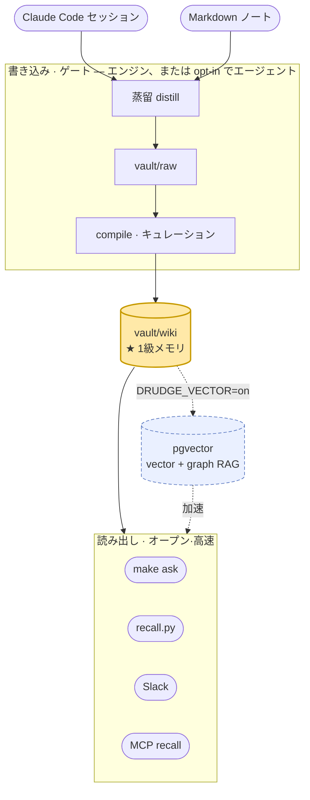
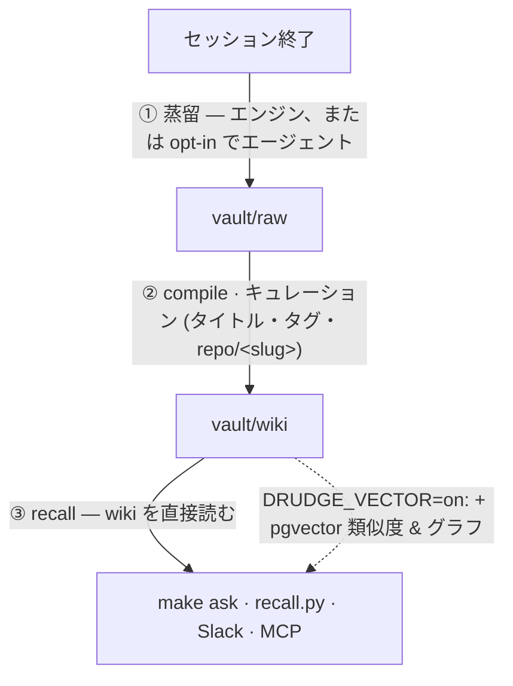

# oh-my-boring

[English](README.md) · [한국어](README.ko.md) · **日本語**

[](https://github.com/jazz1x/oh-my-boring/actions/workflows/ci.yml)

-success)
-000)


**セルフホスト型の個人メモリRAG。** Claude Code（あるいは任意のMarkdownノート）での作業がローカルの人間が読めるwikiに蒸留され、*「前にこれどうやったっけ？」* を後から引き出せる。**クラウド0・100%ローカル。**

> 面倒で後回しにしがちな作業 — 過去の仕事を覚えて掘り起こす退屈な仕事 — を **drudge**（下働き）エンジンが黙々と肩代わりする。



**vault/wiki の Markdown が1級メモリ** — エージェント・エンジンが直接読む（埋め込み不要）。pgvector（vector + graph RAG）は **使いたいときに点ける任意のアクセラレータ**。

---

## なぜ使うか

- **自動蓄積** — セッションが終わると「問題解決の物語」へ蒸留 → `vault/wiki` にキュレーション。手動整理は不要。
- **Markdown優先** — メモリは人間が読めて git diff できる平文 Markdown。回収はそれを直接読む（Karpathy「LLM wiki」方式；個人規模では最も単純で信頼できる）。
- **ローカル専用** — 埋め込み・合成ともローカルの OpenAI互換 LLM サーバー（既定 Ollama）。外部API・トークン0。
- **任意の vector + グラフ** — `DRUDGE_VECTOR=on` で pgvector 類似度 + GraphRAG（problem/solution/tool/concept ノード）。規模・精度が要るとき。

---

## レイヤー

| # | レイヤー | 役割 | `make up` 既定 |
|---|---|---|:---:|
| 1 | **LLM サーバー**（ホスト・OpenAI互換） | 埋め込み `bge-m3` · 合成 `gemma4:12b` — 既定 Ollama、`DRUDGE_LLM_BASE_URL` で LM Studio/vLLM に交換 | 必須[^llm] |
| 2 | **drudge**（Rustエンジン） | distill · compile(raw→wiki) · recall · serve(HTTP+MCP+スケジューラ) | ✓ |
| 3 | **vault/wiki**（Markdown） | 1級メモリ — キュレーション済みノート、直接読み | ✓ (ファイル) |
| 4 | **フック**（ホスト・Python） | セッション→エンジンの糊 (distill·recall·collect) | 手動インストール[^hooks] |
| 5 | **hermes-agent**（脳） | 取り込み/回収/スキル生成を駆動する自律エージェント (MCP) | ✓[^agent] |
| 6 | **Postgres + pgvector** | vector(HNSW) + BM25 + グラフ — **任意**のアクセラレータ | ✗ (`--profile vector`)[^vec] |

[^llm]: ホストに OpenAI互換 `/v1` サーバー（既定 `ollama serve`）。別ランタイムは `DRUDGE_LLM_BASE_URL`（例 LM Studio `:1234/v1`）。
[^hooks]: `~/.claude/settings.json` に登録 — [自己拡張ループ](#自己拡張ループ) 参照。
[^agent]: サードパーティ製イメージ（Nous Hermes Agent）、非同梱 — 先にビルド（[事前準備](#事前準備)）。無ければ `start.sh` が案内を出して停止。
[^vec]: 既定 off（wiki 1級）。`DRUDGE_VECTOR=on` + `docker compose --profile vector up` で点灯（Postgres 同伴）。

> コア = LLM(1) + drudge(2) + wiki ファイル(3)。フック(4)が自動捕捉、エージェント(5)が脳、pgvector(6)は opt-in。

---

## 2つのドア（読み / 書き）

読みと書きは性質が異なるのでドアを分ける:

- **読みドア（オープン・高速）** — 回収は `vault/wiki` を直接読む（~ms、LLM ループ無し、広く開けても安全）。`recall.py`·`make ask`·MCP recall·Slack。読みにエージェントは不要。
- **書きドア（ゲート）** — 取り込みは判断対象: 残す価値があるか、どう整えるか? 既定では **エンジン** が蒸留+ゲート（決定的・信頼）。`DRUDGE_VECTOR=on` でベクトル保存、`DISTILL_VIA_AGENT=1` でゲートをエージェントの判断に経由。

---

## 事前準備

| インストール | 用途 | 確認 |
|---|---|---|
| **Docker**（Compose v2） | コンテナスタック | `docker compose version` |
| **LLM ランタイム**（OpenAI互換） | ローカルの埋め込み・合成 | 既定 **Ollama**（[ollama.com](https://ollama.com) / `brew install ollama`）。LM Studio/vLLM も可 |
| **Python 3** | ホストフック | `python3 --version`（macOS標準） |
| **hermes-agent イメージ** | 脳（既定コア） | `docker image inspect hermes-agent` · 無ければ [Nous Hermes Agent](https://github.com/NousResearch) をビルド + `~/.hermes` 準備 |
| ディスク ~10GB | モデル2つ | `gemma4:12b`（~8GB）+ `bge-m3`（~1.2GB）— `make up`/`make models` が自動pull |

> **クローン先**: `~/oh-my-boring` 推奨（フック・`start.sh`・vault のパス前提）。

---

## クイックスタート

```bash
git clone git@github.com:jazz1x/oh-my-boring.git ~/oh-my-boring
cd ~/oh-my-boring
cp .env.example .env          # 任意（コアは .env なしで動く）
make up                       # Ollama確認 → モデルpull → ビルド → 起動 (wiki モード)
make ask Q="dockerのビルドキャッシュ問題、前にどう直したっけ?"
```

`make up`（wiki 既定）は **drudge + hermes-agent** のみ起動 — Postgres なし。vector + graph RAG を使うなら: `DRUDGE_VECTOR=on make up`（`--profile vector` で Postgres 同伴）。

---

## 自己拡張ループ

セッションが終わると勝手に溜まる — 核心の価値。



| フック | Claude Code イベント | 動作 |
|---|---|---|
| `hooks/distill-session.py` | `SessionEnd` / `Stop` | セッション蒸留 → vault/raw（エンジン、`DISTILL_VIA_AGENT=1` ならエージェント） |
| `hooks/recall.py` | `UserPromptSubmit` | 関連する過去作業を回収しコンテキスト注入 |
| `hooks/collect-sessions.py` | cron / `make collect` | SessionEnd で取り逃したセッションをバックフィル |

**インストール**（永続化）— `~/.claude/settings.json`:

```jsonc
{
  "hooks": {
    "SessionEnd": [
      { "type": "command", "command": "python3 ~/oh-my-boring/hooks/distill-session.py", "timeout": 130, "async": true }
    ],
    "UserPromptSubmit": [
      { "type": "command", "command": "python3 ~/oh-my-boring/hooks/recall.py", "timeout": 10 }
    ]
  }
}
```

> distill/recall が動くにはエンジン（drudge）が起動している必要がある。無ければ静かに no-op — セッションは決してブロックしない。

---

## Nous Hermes Agent 連携

drudge はエージェントの **MCP メモリバックエンド**。エージェント（脳）が駆動し、drudge（手）が機械作業。

1. エージェントは `make up` で同時起動（イメージは先にビルド — [事前準備](#事前準備)）。
2. `~/.hermes/config.yaml` に drudge を MCP サーバー登録:
   ```yaml
   mcp_servers:
     drudge:
       url: http://drudge:7700/mcp   # 同一 compose ネットワーク
       transport: http
   ```
3. MCP ツール（drudge `/mcp`）: `recall{query}`（読み）, `remember{text,title?}`（ノート書き込み）, `sync{}`（compile→ingest）。

---

## デプロイ: Docker / ネイティブ

| 方式 | やり方 | いつ |
|---|---|---|
| **Docker**（既定） | `make up` — drudge + hermes-agent（+`DRUDGE_VECTOR=on` で Postgres） | 最も簡単 |
| **ネイティブ** | `cd drudge && cargo run --release -- serve` | コンテナ不要/開発。env: `DRUDGE_LLM_BASE_URL`·`DRUDGE_VAULT_DIR`·`DRUDGE_SOURCE_DIRS`（+vector なら `PG_DSN`）。drudge=単一の静的バイナリ |

---

## コマンド一覧

全体は `make help`。よく使うもの:

| コマンド | 説明 |
|---|---|
| `make up` | セットアップ+起動（wiki モード; vector は `DRUDGE_VECTOR=on`） |
| `make ask Q="質問"` | 単発クエリ（回収+合成+出典） |
| `make sync` | distill/compile サイクル（vector なら +ingest/graph） |
| `make remember M="内容"` | 一行メモ記録 |
| `make smoke` | end-to-end スモーク |
| `make logs` | drudge ログ |
| `make guard` | 構造ゲート（fmt+clippy+test）— CI と同一 |
| `make deny` | サプライチェーンゲート（cargo-deny） |
| `make down` | 停止（`./data` 保持） |
| `make reset` | ⚠️ Postgres データ初期化（ソースから再取り込み） |

---

## 設定（env）

コアは `.env` なしで動く; 既定値は `docker-compose.yml`。

| 変数 | 既定 | 用途 |
|---|---|---|
| `DRUDGE_VECTOR` | `off` | `on` で pgvector（vector+graph）; off=wiki のみ |
| `DRUDGE_LLM_BASE_URL` | `http://localhost:11434/v1` | OpenAI互換 LLM サーバー（Ollama·LM Studio·…） |
| `DRUDGE_LLM_API_KEY` | — | 認証が必要な provider のみ |
| `DRUDGE_LLM_MODEL` / `DRUDGE_EMBED_MODEL` | `gemma4:12b` / `bge-m3` | 合成 / 埋め込みモデル |
| `DRUDGE_SOURCE_DIRS` | `~/.claude/projects:vault/wiki` | 取り込みソース（vector モード） |
| `DISTILL_VIA_AGENT` | — | 書きゲートを hermes-agent 経由（無ければエンジン distill） |
| `DRUDGE_COMPANY_SUBSTR` / `DISTILL_COMPANY_CWD` | — | パスを `origin=company` タグ付け（既定オフ） |
| `SLACK_APP_TOKEN` / `SLACK_BOT_TOKEN` | — | Slack アシスタント用 |

---

## 開発 · ガードレール

- **SSOT ドキュメント**: `drudge/{PHILOSOPHY,RUST-STYLE,ENFORCEMENT}.md`。
- **原則**: ROP（Result レール）· Parse-don't-validate · Clean Architecture · 最も単純で動くもの。
- **ゲート**（ローカル `make guard` == CI）: `rustfmt --check` + `clippy -D warnings`（`unsafe` forbid + pedantic）+ `cargo test`（スタック非依存）。サプライチェーン: `make deny`。
- **pre-commit**: 一度 `pre-commit install`（ファイル衛生 + gitleaks + fmt/clippy/test）。
- **CI**: PR・main push のたびに `rust-gate` + `gitleaks` + `cargo-deny`、3つすべて必須（admin 回避不可）。

---

## ディレクトリ

```text
oh-my-boring/
├─ drudge/             # Rustエンジン (distill·compile·recall·wiki_recall·serve·store·llm)
├─ hooks/              # ホストフック (distill-session · recall · collect-sessions)
├─ scripts/            # guard.sh · smoke.sh · eval-gate.sh
├─ vault/              # raw(蒸留) → compile → wiki(1級メモリ)。.rules/ スキーマ
├─ data/               # Postgres 永続化(vector モード) — gitignore
├─ docker-compose.yml  # drudge + hermes-agent (+ --profile vector: Postgres)
├─ start.sh            # make up の実体
└─ Makefile            # コマンドの入口
```
