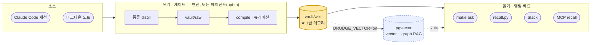
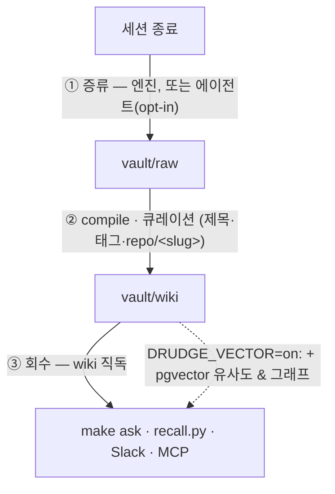

# oh-my-boring

[English](README.md) · **한국어** · [日本語](README.ja.md)

[](https://github.com/jazz1x/oh-my-boring/actions/workflows/ci.yml)

-success)
-000)


**셀프호스팅 개인 메모리 RAG.** Claude Code(또는 아무 마크다운 노트) 작업이 로컬의 사람이 읽는 위키로 증류돼 쌓이고, *"전에 이거 어떻게 했더라"* 를 다시 꺼내 쓴다. **클라우드 0 · 100% 로컬.**

> 게을러서 안 하던 일 — 과거 작업을 기억하고 다시 찾아보는 그 지루한 일 — 을 **drudge**(막일꾼) 엔진이 대신 묵묵히 한다.



**vault/wiki 마크다운이 1급 메모리** — 에이전트·엔진이 직접 읽는다(임베딩 불필요). pgvector(vector + graph RAG)는 **켜고 싶을 때 켜는 옵션 가속기**.

---

## 왜 쓰나

- **자동 축적** — 세션 끝나면 '문제해결 서사'로 증류 → `vault/wiki` 큐레이션. 수동 정리 불필요.
- **마크다운 우선** — 메모리가 사람이 읽고 git diff 되는 평문 마크다운. 회수가 그걸 직독(Karpathy "LLM wiki" 방식; 개인 규모엔 가장 단순·신뢰).
- **로컬 전용** — 임베딩·합성 모두 로컬 OpenAI-호환 LLM 서버(기본 Ollama). 외부 API·토큰 0.
- **옵션 vector + 그래프** — `DRUDGE_VECTOR=on` 면 pgvector 유사도 + GraphRAG(problem/solution/tool/concept 노드). 규모/정확도 필요할 때.

---

## 레이어

| # | 레이어 | 역할 | `make up` 기본 |
|---|---|---|:---:|
| 1 | **LLM 서버** (호스트, OpenAI-호환) | 임베딩 `bge-m3` · 합성 `gemma4:12b` — Ollama 기본, `DRUDGE_LLM_BASE_URL` 로 LM Studio/vLLM 교체 | 필요[^llm] |
| 2 | **drudge** (Rust 엔진) | distill · compile(raw→wiki) · recall · serve(HTTP+MCP+스케줄러) | ✓ |
| 3 | **vault/wiki** (마크다운) | 1급 메모리 — 큐레이션 노트, 직독 | ✓ (파일) |
| 4 | **훅** (호스트, Python) | 세션→엔진 접착제 (distill·recall·collect) | 수동 설치[^hooks] |
| 5 | **hermes-agent** (뇌) | 적재/회수/스킬생성을 모는 자율 에이전트 (MCP) | ✓[^agent] |
| 6 | **Postgres + pgvector** | vector(HNSW) + BM25 + 그래프 — **옵션** 가속기 | ✗ (`--profile vector`)[^vec] |

[^llm]: 호스트에 OpenAI-호환 `/v1` 서버(기본 `ollama serve`). 다른 런타임은 `DRUDGE_LLM_BASE_URL`(예 LM Studio `:1234/v1`).
[^hooks]: `~/.claude/settings.json` 에 등록 — [자가증강 루프](#자가증강-루프) 참고.
[^agent]: 서드파티 이미지(Nous Hermes Agent), 레포 미포함 — 먼저 빌드([사전 준비](#사전-준비)). 없으면 `start.sh` 가 안내 후 멈춤.
[^vec]: 기본 off(wiki 1급). `DRUDGE_VECTOR=on` + `docker compose --profile vector up` 로 켬(Postgres 동반).

> 코어 = LLM(1) + drudge(2) + wiki 파일(3). 훅(4)이 자동 포착, 에이전트(5)가 뇌, pgvector(6)는 opt-in.

---

## 두 문 (읽기 / 쓰기)

읽기와 쓰기는 성질이 달라 문을 따로 쓴다:

- **읽기 문 (열림·빠름)** — 회수는 `vault/wiki` 직독(~ms, LLM 루프 없음, 널리 열어도 안전). `recall.py`·`make ask`·MCP recall·Slack. 읽기는 에이전트 불필요.
- **쓰기 문 (게이트)** — 적재는 판단 대상: 넣을 가치 있나, 어떻게 다듬나? 기본은 **엔진**이 증류+게이트(결정적·신뢰). `DRUDGE_VECTOR=on` 면 벡터 저장, `DISTILL_VIA_AGENT=1` 면 게이트를 에이전트 판단으로 경유.

---

## 사전 준비

| 깔 것 | 용도 | 확인 |
|---|---|---|
| **Docker** (Compose v2) | 컨테이너 스택 | `docker compose version` |
| **LLM 런타임** (OpenAI-호환) | 로컬 임베딩·합성 | 기본 **Ollama** ([ollama.com](https://ollama.com) / `brew install ollama`). LM Studio/vLLM 도 가능 |
| **Python 3** | 호스트 훅 | `python3 --version` (macOS 기본) |
| **hermes-agent 이미지** | 뇌(기본 코어) | `docker image inspect hermes-agent` · 없으면 [Nous Hermes Agent](https://github.com/NousResearch) 빌드 + `~/.hermes` 준비 |
| 디스크 ~10GB | 모델 2개 | `gemma4:12b`(~8GB) + `bge-m3`(~1.2GB) — `make up`/`make models` 자동 pull |

> **클론 위치**: `~/oh-my-boring` 권장(훅·`start.sh`·vault 경로 기준).

---

## 빠른 시작

```bash
git clone git@github.com:jazz1x/oh-my-boring.git ~/oh-my-boring
cd ~/oh-my-boring
cp .env.example .env          # 선택(코어는 .env 없이도 동작)
make up                       # Ollama 확인 → 모델 pull → 빌드 → 기동 (wiki 모드)
make ask Q="도커 빌드 캐시 문제 전에 어떻게 풀었지?"
```

`make up`(wiki 기본)은 **drudge + hermes-agent** 만 띄움 — Postgres 없음. vector + graph RAG 쓰려면: `DRUDGE_VECTOR=on make up`(`--profile vector` 로 Postgres 동반).

---

## 자가증강 루프

세션이 끝나면 알아서 쌓인다 — 핵심 가치.



| 훅 | Claude Code 이벤트 | 하는 일 |
|---|---|---|
| `hooks/distill-session.py` | `SessionEnd` / `Stop` | 세션 증류 → vault/raw (엔진, `DISTILL_VIA_AGENT=1` 면 에이전트) |
| `hooks/recall.py` | `UserPromptSubmit` | 관련 과거 작업 회수해 컨텍스트 주입 |
| `hooks/collect-sessions.py` | 크론 / `make collect` | SessionEnd 놓친 세션 백필 |

**설치**(영속) — `~/.claude/settings.json`:

```jsonc
{
  "hooks": {
    "SessionEnd": [
      { "type": "command", "command": "python3 ~/oh-my-boring/hooks/distill-session.py", "timeout": 130, "async": true }
    ],
    "UserPromptSubmit": [
      { "type": "command", "command": "python3 ~/oh-my-boring/hooks/recall.py", "timeout": 10 }
    ]
  }
}
```

> 엔진(drudge)이 떠 있어야 distill/recall 동작. 안 떠 있으면 조용히 no-op — 세션 절대 미차단.

---

## Nous Hermes Agent 연결

drudge 는 에이전트의 **MCP 메모리 백엔드**. 에이전트(뇌)가 몰고, drudge(손)가 기계작업.

1. 에이전트는 `make up` 으로 함께 뜸(이미지 선빌드 — [사전 준비](#사전-준비)).
2. `~/.hermes/config.yaml` 에 drudge MCP 등록:
   ```yaml
   mcp_servers:
     drudge:
       url: http://drudge:7700/mcp   # 같은 compose 네트워크
       transport: http
   ```
3. MCP 툴(drudge `/mcp`): `recall{query}`(읽기), `remember{text,title?}`(노트 쓰기), `sync{}`(compile→ingest).

---

## 배포: Docker / 네이티브

| 방식 | 어떻게 | 언제 |
|---|---|---|
| **Docker** (기본) | `make up` — drudge + hermes-agent (+`DRUDGE_VECTOR=on` 이면 Postgres) | 가장 간단 |
| **네이티브** | `cd drudge && cargo run --release -- serve` | 컨테이너 없이/개발. env: `DRUDGE_LLM_BASE_URL`·`DRUDGE_VAULT_DIR`·`DRUDGE_SOURCE_DIRS`(+vector면 `PG_DSN`). drudge=단일 정적 바이너리 |

---

## 명령 레퍼런스

전체 `make help`. 자주:

| 명령 | 설명 |
|---|---|
| `make up` | 셋업+기동 (wiki 모드; vector는 `DRUDGE_VECTOR=on`) |
| `make ask Q="질문"` | 질의 1회 (회수+합성+출처) |
| `make sync` | distill/compile 사이클 (vector면 +ingest/graph) |
| `make remember M="내용"` | 한 줄 메모 기록 |
| `make smoke` | end-to-end 스모크 |
| `make logs` | drudge 로그 |
| `make guard` | 구조 게이트(fmt+clippy+test) — CI 동일 |
| `make deny` | 공급망 게이트(cargo-deny) |
| `make down` | 정지(`./data` 유지) |
| `make reset` | ⚠️ Postgres 데이터 초기화(소스 재적재) |

---

## 설정 (env)

코어는 `.env` 없이 동작; 기본값은 `docker-compose.yml`.

| 변수 | 기본 | 용도 |
|---|---|---|
| `DRUDGE_VECTOR` | `off` | `on` 이면 pgvector(vector+graph); off=wiki 전용 |
| `DRUDGE_LLM_BASE_URL` | `http://localhost:11434/v1` | OpenAI-호환 LLM 서버(Ollama·LM Studio·…) |
| `DRUDGE_LLM_API_KEY` | — | 인증 필요한 provider 만 |
| `DRUDGE_LLM_MODEL` / `DRUDGE_EMBED_MODEL` | `gemma4:12b` / `bge-m3` | 합성 / 임베딩 모델 |
| `DRUDGE_SOURCE_DIRS` | `~/.claude/projects:vault/wiki` | 흡수 소스(vector 모드) |
| `DISTILL_VIA_AGENT` | — | 쓰기 게이트를 hermes-agent 경유(아니면 엔진 distill) |
| `DRUDGE_COMPANY_SUBSTR` / `DISTILL_COMPANY_CWD` | — | 경로를 `origin=company` 태깅(기본 꺼짐) |
| `SLACK_APP_TOKEN` / `SLACK_BOT_TOKEN` | — | Slack 비서용 |

---

## 개발 · 가드레일

- **SSOT 문서**: `drudge/{PHILOSOPHY,RUST-STYLE,ENFORCEMENT}.md`.
- **원칙**: ROP(Result 레일) · Parse-don't-validate · Clean Architecture · 단순함 우선.
- **게이트**(로컬 `make guard` == CI): `rustfmt --check` + `clippy -D warnings`(`unsafe` forbid + pedantic) + `cargo test`(스택-프리). 공급망: `make deny`.
- **pre-commit**: 1회 `pre-commit install` (파일위생 + gitleaks + fmt/clippy/test).
- **CI**: PR·main push 마다 `rust-gate` + `gitleaks` + `cargo-deny`, 셋 다 필수(admin 우회 불가).

---

## 디렉터리

```text
oh-my-boring/
├─ drudge/             # Rust 엔진 (distill·compile·recall·wiki_recall·serve·store·llm)
├─ hooks/              # 호스트 훅 (distill-session · recall · collect-sessions)
├─ scripts/            # guard.sh · smoke.sh · eval-gate.sh
├─ vault/              # raw(증류) → compile → wiki(1급 메모리). .rules/ 스키마
├─ data/               # Postgres 영속(vector 모드) — gitignore
├─ docker-compose.yml  # drudge + hermes-agent (+ --profile vector: Postgres)
├─ start.sh            # make up 실체
└─ Makefile            # 명령 진입점
```
