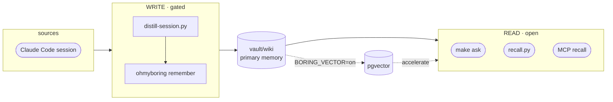

# ohmyboring

[English](README.md) · **한국어** · [日本語](README.ja.md)

[](https://github.com/jazz1x/ohmyboring/actions/workflows/ci.yml)

[](LICENSE)


**셀프호스팅 개인 메모리 RAG.** Claude Code / Kimi Code 세션과 적재 가능한 Codex 트랜스크립트가 로컬의 사람이 읽는 위키로 증류돼 쌓이고, *"전에 이거 어떻게 했더라"* 를 다시 꺼내 쓴다. **클라우드 0 · 100% 로컬.**

```bash
# 가장 빠름 — 원라이너: ~/oh-my-boring에 클론, 빌드, 훅/MCP/워커까지 연결.
sh -c "$(curl -fsSL https://raw.githubusercontent.com/jazz1x/ohmyboring/main/install.sh)"
```

또는 단계별로:

```bash
git clone https://github.com/jazz1x/ohmyboring.git ~/oh-my-boring
cd ~/oh-my-boring
make up
make doctor         # 스택, 훅, Codex 워커/큐, 마지막 적재 확인
make readiness      # 아침 브리핑 의존 전 strict 게이트
make collect N=20   # 과거 Claude Code 세션으로 vault 채우기 (새 클론은 비어 있음)
make ask Q="docker build cache 문제 어떻게 고쳤더라?"
```

> 새로 클론하면 **vault가 비어 있어** 첫날 `make ask`는 찾을 게 없습니다. `make collect`로 Claude 과거 기록을 채우고 나면, 이후 Claude/Kimi 세션은 자동 축적되고 Codex는 적재 가능한 트랜스크립트를 워커가 처리합니다([적재하기](#적재하기-ingestion) 참고).

> **Docker**, **Ollama** 또는 **LM Studio** 같은 OpenAI-compatible 로컬 서버, **Python 3**, **jq**, **curl**, **git**, **make**가 필요합니다.

---

## 기능

1. **자동 축적** — 세션이 끝나거나 Codex 워커가 적재 가능한 트랜스크립트를 찾으면 `vault/wiki`에 정리된 마크다운 노트로 변환됩니다. 수동 관리 불필요.
2. **마크다운 중심 메모리** — 일반 텍스트, 사람이 읽기 쉬움, git diff 가능. 검색도 마크다운을 직접 읽습니다.
3. **로컬 전용** — 임베딩과 요약이 Ollama, LM Studio 또는 다른 OpenAI-compatible 엔드포인트에서 실행됩니다. 외부 API나 토큰 없음.

선택적으로 **pgvector** 가속기(`BORING_VECTOR=on`)를 켜면 유사도 검색 + GraphRAG이 추가됩니다.

---

## 적재하기 (ingestion)

메모리가 들어오는 경로는 네 가지입니다 — 설정 후 자동 경로들은 거의 손댈 일이 없습니다:

| 방법 | 명령 | 언제 |
| --- | --- | --- |
| **자동 (세션 종료 시)** | SessionEnd 훅 (`install.sh`가 설치) | 모든 Claude Code / Kimi 세션 — `hooks/distill-session.py`가 트랜스크립트를 증류해 `remember`합니다. 짝이 되는 `UserPromptSubmit` 훅(`recall.py`)이 관련 과거 메모리를 새 프롬프트에 자동 주입합니다. |
| **자동 (Codex 워커)** | 호스트 launchd/cron 워커 (`install.sh`가 설치) | Codex에는 SessionEnd 훅이 없습니다. 호스트 워커가 20분마다 `~/.codex/sessions/**/*.jsonl`을 스캔하고, 아직 쓰이는 중인 transcript와 실제 subagent rollout은 건너뛰며, 적재 가능한 transcript를 같은 `remember` 경로로 저장합니다. `hermes-agent`가 켜져 있으면 `codex-memory-ingest-worker`도 함께 설치됩니다. 둘 다 `make doctor`로 확인합니다. |
| **과거 세션 백필** | `make collect [N=20]` | 설치 직후, 비어 있는 vault를 `~/.claude/projects` 기록으로 채울 때. 최신순, 멱등(세션별 마커로 이미 증류한 건 건너뜀), 한 번에 `N`개만 처리해 CPU를 독점하지 않음. |
| **지금 바로 (세션 안 끝내고)** | `make distill-now` · `make remember M="…"` | 세션을 끝내지 않고 즉시 적재할 때. `distill-now`는 **현재** 트랜스크립트를 그때그때 다시 증류하고 마커를 남기지 않으므로, 세션 종료 시의 정상 적재도 그대로 동작합니다(초기 노트 + 최종 노트가 함께 생길 수 있음). `remember`는 직접 작성한 노트를 저장합니다. |

### 훅 수동 연결

`install.sh`가 자동으로 해줍니다. 다시 하려면(또는 `BORING_WIRE=0`로 실행했다면):

```bash
python3 agents/shared/agent_wiring.py --install \
  --boring-home ~/oh-my-boring --server-name ohmyboring \
  --server-url http://localhost:7700/mcp
```

이 명령은 Claude/Kimi 훅, Cursor/Codex MCP 항목, Codex 호스트 워커, 그리고 `hermes-agent`가 켜진 경우 Hermes cron 워커를 설정합니다. Claude만 직접 편집하려면 `~/.claude/settings.json`에 `python3 ~/oh-my-boring/hooks/distill-session.py`를 실행하는 `SessionEnd` 훅과 `recall.py`를 실행하는 `UserPromptSubmit` 훅을 추가합니다.

---

## 내 메모리 보기

노트는 그냥 마크다운이므로, **`vault/` 폴더를 [Obsidian](https://obsidian.md) 보관함(vault)으로 열면** 그래프 뷰, 백링크, 태그, 전문 검색을 그대로 쓸 수 있습니다. 컴파일된 노트에는 이미 Obsidian-safe `tags`와 `[[wiki-NNNN]]` `relates_to` 링크가 들어 있어, 그래프 뷰가 메모리의 연결 관계를 바로 그려 줍니다(`BORING_VECTOR=on`일 때 GraphRAG 그래프가 이 링크로 투영되어 가장 풍부합니다). 별도 UI를 만들 필요가 없습니다. Obsidian이 만드는 `.obsidian/` 작업 폴더는 gitignore 처리되어, 내 레이아웃이 로컬에만 남고 git에 새지 않습니다.

---

## 아키텍처



- **Read door** — 빠르고 LLM 불필요. `make ask`, `recall.py`, MCP `recall`이 `vault/wiki`를 직접 읽습니다.
- **Write door** — gated. `distill-session.py`가 로컬 LLM을 호출하고 ohmyboring의 `remember` MCP tool로 기록합니다.

### 작업 흐름 그래프 계약

적재 루프에는 `drudge/src/workflow.rs`에 Rust 쪽 작업 흐름 그래프 계약이 있고, `drudge/WORKFLOW.md`에 문서화되어 있습니다. 세션 발견, 증류, 해상도 검증, 보강, `remember`, 마커 갱신, 이벤트 기록, readiness 투영을 닫힌 타입의 LangGraph 스타일 상태 그래프로 표현합니다. 두 번째 런타임 오케스트레이터는 아닙니다. Python 훅/워커는 계속 호스트 I/O를 맡고, Rust는 노드/엣지 어휘와 그래프 형태 테스트를 소유합니다.

---

## 설정

정책은 **`boring.json`**(`make up` 시 `boring.example.json`에서 생성)에:

```json
{
  "$schema": "https://raw.githubusercontent.com/jazz1x/ohmyboring/main/boring.schema.json",
  "schema_version": 2,
  "note_lang": "auto",
  "llm": {
    "provider": "ollama",
    "base_url": "http://host.docker.internal:11434/v1",
    "model": "qwen3:14b",
    "embed_model": "bge-m3",
    "embed_dim": 1024,
    "api_key_env": "BORING_LLM_API_KEY",
    "bootstrap": "auto"
  },
  "repos": [
    {"match": "your-company", "origin": "company", "name": "your-company"},
    {"match": "~/code", "origin": "personal", "name": "mine"}
  ],
  "agents": [
    {"id": "claude-code", "enabled": true, "format": "claude-json", "paths": ["~/.claude/projects"]}
  ]
}
```

| Key | 용도 |
|---|---|
| `note_lang` | `auto` · `ko` · `en` |
| `llm.provider` | `ollama`(모델 pull) · `lmstudio`(앱에서 로드, pull 없음) · `openai-compatible`(vLLM / llama.cpp / 원격) |
| `llm.base_url` / `llm.model` | OpenAI-compatible `/v1` 엔드포인트 + 합성 모델 |
| `llm.embed_model` / `llm.embed_dim` | 임베딩 모델 + 그 벡터 차원(커널의 유일한 모델) |
| `llm.bootstrap` | `auto` = 부트스트랩이 기동/pull 가능 · `manual` = 헬스체크만(서버는 사용자 소유) |
| `repos[]` | 경로/remote 규칙 → `origin=personal/company/mirror/community` |
| `agents[]` | vector mode ingest source |

**LLM 백엔드 전환**은 config 블록 하나로 끝납니다. `make up`은 `scripts/llm-providers/<provider>.sh` 로 디스패치합니다. Ollama는 서버 시작과 모델 pull을 할 수 있고, LM Studio는 앱에서 모델을 이미 로드했다고 보고 서버 상태만 확인합니다.

### LM Studio 백엔드

LM Studio는 OpenAI-compatible `/v1` 서버로 붙습니다. Docker 컨테이너가 호스트의 LM Studio에 접근해야 하므로 `boring.json`에는 `host.docker.internal`을 쓰고, 호스트에서 직접 확인하거나 벤치마크할 때만 `localhost`를 씁니다.

```json
{
  "llm": {
    "provider": "lmstudio",
    "base_url": "http://host.docker.internal:1234/v1",
    "model": "<v1/models에 나온 정확한 chat model id>",
    "embed_model": "<v1/models에 나온 정확한 embedding model id>",
    "embed_dim": 768,
    "api_key_env": "BORING_LLM_API_KEY",
    "bootstrap": "manual"
  }
}
```

LM Studio 로컬 서버를 켜고 chat 모델과 embedding 모델을 하나씩 로드한 뒤, `make up` 전에 확인합니다:

```bash
curl -s http://localhost:1234/v1/models | jq -r '.data[].id'
make verify-llm
make up
make doctor
make readiness
```

모델 id는 LM Studio가 반환한 값과 정확히 같아야 합니다. `make verify-llm`은 `/v1/embeddings`도 직접 호출해 실제 벡터 길이가 `llm.embed_dim`과 같은지 확인합니다. 현재 1024d 릴리즈 경로에서는 LM Studio가 `bge-m3`를 서빙할 때만 vector-ready이고, `text-embedding-nomic-embed-text-v1.5`는 별도의 768d reset/re-index 경로입니다. 전체 체크리스트는 [LM Studio 런북](docs/runbooks/lmstudio.ko.md)을 참고하세요.

`.env`는 이제 시크릿 + 런타임 오버라이드 전용:

| Variable | 용도 |
|---|---|
| `BORING_VECTOR` | `on` 시 pgvector 활성화(선택) |
| `BORING_LLM_BASE_URL` / `BORING_LLM_MODEL` | `llm.base_url` / `llm.model` 런타임 오버라이드(선택). `drudge` 바이너리를 호스트에서 직접 실행한다면 `BORING_LLM_BASE_URL=http://localhost:11434/v1` 설정 |
| `BORING_LLM_API_KEY` | `llm.api_key_env`가 여기를 가리킬 때의 API 키(인증 provider) |
| `DOCKER_BIN` | GUI/launchd 환경의 `PATH`에 Docker가 없을 때 사용할 선택적 Docker CLI 경로 |
| `BORING_DISTILL_RESOLUTION` | 적재 해상도 계약: `compact`, `standard`, `evidence`(기본), `forensic`; 검증 실패 시 한 번 보강하고 그래도 실패하면 `remember` 차단 |
| `DISTILL_CLAMP` | 직접 SessionEnd hook이 로컬 LLM에 보내는 최대 문자 수; 로컬 모델 timeout을 피하기 위해 기본값은 `2000`. Hermes worker offer는 계속 `INGEST_CLAMP`(`4000`)를 사용 |
| `BORING_EVENT_LOG` | 로컬 NDJSON 작업 흐름 이벤트; 기본값 `~/.cache/oh-my-boring/events.ndjson` |
| `BORING_EVENT_RECENT_HOURS` | `make readiness`가 보는 최근 이벤트 범위; 기본값 `24` |
| `BORING_READINESS_NOTE_MAX_HOURS` | 브리핑 readiness가 허용하는 최신 노트 freshness 범위; 기본값 `48` |
| `BORING_READINESS_PENDING_TTL` | readiness에서 stale `.pending`으로 보는 임계값; `INGEST_PENDING_TTL`, 그다음 `1800`초를 기본으로 사용 |
| `BORING_READINESS_RETRY_TTL` | readiness에서 stale `.retry`로 보는 임계값; `INGEST_RETRY_TTL`, 그다음 pending 임계값을 기본으로 사용 |
| `SLACK_APP_TOKEN` / `SLACK_BOT_TOKEN` | 선택적 Slack assistant |

구조화 이벤트는 distill, collector/worker, `doctor`/`readiness`, `guard`, `eval`에서 기록됩니다. memory-ingest 이벤트에는 Rust 작업 흐름 그래프 계약을 따르는 `workflow=memory_ingest`, `workflow_node`, `workflow_outcome` 필드가 붙습니다. 최근 로컬 타임라인은 `make events`로 확인합니다.

> **임베딩 모델을 바꾸면 벡터 차원이 바뀝니다.** 합성 모델(`llm.model`)은 자유롭게 교체해도 되지만, `llm.embed_model`을 바꾸면 크기가 다른 벡터가 나오므로, `llm.embed_dim`을 맞게 수정하고 **그리고** `make reset`을 실행해야 합니다 — 그러지 않으면 기존 형태의 벡터에 대한 upsert가 실패합니다. 흔한 차원: `bge-m3` = 1024 · OpenAI `text-embedding-3-small` = 1536 · `nomic-embed-text` = 768.

### 로컬 모델 선택

ohmyboring은 두 개의 로컬 모델을 사용합니다: 증류/ask용 **합성 모델**, 그리고 벡터 검색용 **임베딩 모델**. 합성 모델은 자유롭게 교체할 수 있고, 임베딩 모델은 `llm.embed_dim` 업데이트와 `make reset`이 필요합니다.

아래는 MacBook RAM 용량별 동급 페어 가이드입니다. 해당 RAM에 쓸 만한 모델이 없으면 칸을 비워둡니다.

| MacBook RAM | gemma4 (Google) | qwen3 (Alibaba) | 비고 |
|------------:|-----------------|-----------------|------|
| 8 GB | *(비움)* | `qwen3:4b` | Gemma4는 8 GB에 실용적인 모델이 없음. |
| 16 GB | `gemma4:12b` | `qwen3:14b` | 가장 동급인 dense 페어 (12B vs 14B). |
| 24 GB | `gemma4:26b-a4b` | `qwen3:30b-a3b` | 동급 MoE 페어. |
| 32 GB | `gemma4:31b` | `qwen3:32b` | dense 플래그십 페어. |
| 48 GB | `gemma4:31b` | `qwen3:32b` | 32 GB와 동일하나 컨텍스트/동시 앱 여유. |
| 64 GB+ | *(비움)* | *(비움)* | 실용적인 새 로컬 페어 없음; `qwen3:235b-a22b`는 디스크 ~142 GB. |

벤치마크 명령:

```bash
# RAM 티어별 LLM 증류 벤치마크
make bench-llm                  # 기본 16 GB 티어
make bench-llm-tier TIER=32gb

# 임베딩 모델 벤치마크 (차원 / 지연 / 상식 검증)
make bench-embed
```

MacBook Pro(M5 Pro, 48 GB RAM) + 로컬 Ollama에서 측정한 결과, 16 GB 티어 페어(`gemma4:12b` vs `qwen3:14b`)는 한국어와 영어 프롬프트에서 유효 JSON 100%, 목표 언어 제목 100%, 2개 이상 본문 섹션 100%, 메타데이터 누수 없음을 기록했다. 일본어에서는 `qwen3:14b`가 가끔 제목을 한국어로 돌아가는 현상(3샘플 기준 일본어 제목 67%)이 있었고, `gemma4:12b`와 `qwen3:8b`는 100%를 유지했다. 평균 지연: `gemma4:12b` ~13–16초, `qwen3:14b` ~12–18초, `qwen3:8b` ~6–8초. `bge-m3` 임베딩은 텍스트당 평균 **0.105초**, 코사인 상식 검증도 통과했다.

언어별 상세 표, 태그 크기, 방법론, LM Studio 안내는 [`docs/reports/llm-pair-matrix.md`](docs/reports/llm-pair-matrix.md)를 참고하세요.

### 네이밍 계층

계층마다 이름 하나 — `ohmyzsh` ↔ `~/.oh-my-zsh` 패턴. 대상이 바뀌는 게 아니라 계층이 바뀝니다:

| 계층 | 이름 | 등장 위치 |
|---|---|---|
| 브랜드 / repo / MCP 서버 | `ohmyboring` | repo URL, `.mcp.json`, `--server-name` |
| 설치 디렉토리 / compose 프로젝트 | `~/oh-my-boring` | clone 경로, `BORING_HOME`, compose 프로젝트명 |
| 엔진 패키지 / 바이너리 | `drudge` | `Cargo.toml`, 소스, `drudge` CLI |
| 컨테이너 | `boring-*` | `boring-drudge` · `boring-postgres` · `boring-agent` |
| 환경변수 prefix | `BORING_*` | `BORING_VECTOR` · `BORING_URL` · `BORING_LLM_*` · `BORING_VAULT_DIR` · `BORING_HOME` |

---

## 명령어

| Command | 설명 |
|---|---|
| `make up` | ohmyboring 엔진 실행(hermes-agent 이미지가 있을 때만 함께 실행) |
| `make ollama` | Ollama 실행 확인(필요시 백그라운드 시작) |
| `make verify-llm` | provider 접근성, 로드된 모델 id, 실제 embedding 차원 확인 |
| `make doctor` | 스택, 훅, 마지막 적재, Codex 워커/큐 상태 진단 |
| `make readiness` | 브리핑 전 strict 게이트; 모델/임베딩, 훅, 컨테이너, 워커, stale marker, freshness finding이 있으면 실패 |
| `make ask Q="..."` | recall + 요약 한 번에 |
| `make sync` | vault 재적재 |
| `make remember M="text"` | 한 줄 노트 작성 |
| `make collect [N=1]` | 과거 Claude Code 세션 lazy 백필 |
| `make collect-kimi [N=1]` | 과거 Kimi Code 세션 lazy 백필 |
| `make hermes-build` | 선택적 hermes-agent 이미지 클론/빌드 |
| `make smoke` | end-to-end smoke test |
| `make logs` | 엔진 로그 |
| `make events [N=20]` | 최근 로컬 구조화 작업 흐름 이벤트 보기 |
| `make guard` | fmt + clippy + test + Python py-compile |
| `make quality` | 릴리즈 수용성 drift 게이트 |
| `make down` | 컨테이너 중지 |

---

## 사용 예시

### 지원 에이전트 전체 백필

```bash
# Claude Code (기본 make collect)
make collect N=20

# Kimi Code
make collect-kimi N=20

# GitHub Codex (평소에는 Hermes 워커가 처리)
make doctor
COLLECT_LIMIT=20 python3 agents/codex/collect-sessions.py
```

### 일간/주간 소비

```bash
# 세션 시작용 구조화 컨텍스트 카드 (BORING_VECTOR=off에서도 동작)
curl -s -X POST http://localhost:7700/context \
  -H 'content-type: application/json' \
  -d '{"project":"omb","max_items":5}' | jq .

# 주간 브리핑 (BORING_VECTOR=on 필요)
curl -s -X POST http://localhost:7700/weekly \
  -H 'content-type: application/json' \
  -d '{"project":"omb"}' | jq .

# Slack으로 나갈 아침 브리핑 텍스트 미리보기
BORING_URL=http://127.0.0.1:7700 python3 agents/hermes/briefing.py

# Stalled register — 7일 이상 멈춘 항목 (BORING_VECTOR=on 필요)
curl -s -X POST http://localhost:7700/stalled \
  -H 'content-type: application/json' \
  -d '{"project":"omb","older_than_days":7}' | jq .
```

Hermes cron은 브리핑 스크립트의 stdout을 Slack `mrkdwn` 텍스트로 보냅니다. `make eval` fixture 노트는 게이트 실행 중 검색에는 쓰이지만, 종료 후 prune되며 recency/claim 브리핑 surface에서도 제외되어 일간/주간 브리핑에 섞이지 않습니다.

### PII / 민감 데이터 게이트

정책은 `vault/rules/pii.yaml`에 있고, 선택적 gitignored `vault/rules/pii.local.yaml`로 오버레이할 수 있습니다:

```yaml
# vault/rules/pii.local.yaml — 회사 특정 형태, 커밋 금지
version: "1.0"
policy:
  default_action: flag
  exemption_marker: "<!-- pii-allow:"
rules:
  - name: internal-ticket
    regex: '\bPROJ-\d{4,}\b'
    action: flag
    severity: warning
    reason: "Internal ticket id"
  - name: staging-password
    regex: '\bstaging[_-]?pass\s*=\s*[^\s]+'
    action: redact
    replacement: "[STAGING-PASS]"
    severity: critical
    reason: "Staging credential"
```

`block` 규칙은 `remember` 시점에 노트를 거부하고, `redact` 규칙은 저장 전 마스킹하며, `flag` 규칙은 노트를 저장하면서 `pii-flag` 태그를 붙입니다. 특정 줄의 flag 규칙을 한 번만 통과시키려면 해당 줄에 면제 마커를 추가하세요:

```markdown
Jira 티켓 PROJ-1234 <!-- pii-allow: internal-ticket --> 는 공개입니다.
```

### MCP tool 호출 예시 (raw JSON-RPC)

```bash
curl -s -X POST http://localhost:7700/mcp \
  -H 'content-type: application/json' \
  -d '{
    "jsonrpc": "2.0",
    "id": 1,
    "method": "tools/call",
    "params": {
      "name": "recall",
      "arguments": {
        "query": "docker build cache fix",
        "max_tokens": 1500,
        "max_results": 3,
        "project": "omb",
        "since_hours": 168
      }
    }
  }' | jq .
```

---

## 에이전트 어댑터

`agents/`는 외부 에이전트를 ohmyboring 엔진에 연결하는 **호스트측 어댑터**입니다. 모든 어댑터는 동일한 MCP/HTTP 표면을 통해 ohmyboring와 통신하며, 모두 선택 사항입니다.

기존 `hooks/` 경로는 backward-compatible symlink 세트로 남아 있어, 기존 Claude Code `settings.json` 항목과 cron job이 깨지지 않습니다.

| 어댑터 | 경로 | 소비 주체 | 진입점 | 역할 |
|---|---|---|---|---|
| Claude Code | `agents/claude-code/distill-session.py` | `SessionEnd` / `Stop` hook | 세션을 요약해 `remember` 호출 |
| Claude Code | `agents/claude-code/recall.py` | `UserPromptSubmit` hook | 관련 snippet을 가져와 프롬프트 context 주입 |
| Kimi Code | `agents/kimi/distill-session.py` | `SessionEnd` hook | Kimi 세션을 요약해 `remember` 호출 |
| Kimi Code | `agents/kimi/recall.py` | `UserPromptSubmit` hook | 관련 snippet을 가져와 프롬프트 context 주입 |
| Cursor | `agents/cursor/README.md` | MCP only | `~/.cursor/mcp.json` | `ohmyboring`를 MCP 서버로 노출 |
| Codex | `agents/codex/README.md` | MCP + 호스트 워커 백필 | `~/.codex/mcp.json` / launchd 또는 cron / `collect-sessions.py` | `ohmyboring`를 MCP 서버로 노출하고 적재 가능한 Codex 세션을 백필. 설치된 워커는 안정화된 rollout transcript를 수확하고 실제 subagent는 건너뜀 |
| hermes-agent | `agents/hermes/ingest-worker.py` | `hermes cron --script` | Claude/Codex 적재 워커와 정기 브리핑 실행 |
| scheduler | `agents/schedulers/collect-sessions.py` | cron / launchd / 수동 | 오래된 Claude Code 세션 lazy 백필 |
| scheduler | `agents/schedulers/collect-kimi-sessions.py` | cron / launchd / 수동 | 오래된 Kimi Code 세션 lazy 백필 |
| shared | `agents/shared/boring_config.py` | 어댑터 import | `boring.json` 정책 로더 |
| shared | `agents/shared/agent_wiring.py` | `install.sh` | 활성화된 에이전트의 hook/MCP 설정을 idempotent하게 구성 |

### 토큰 예산

자동 검색은 에이전트의 context window를 폭발시킬 수 있으므로, 검색 표면은 예산을 인식합니다.

- MCP `recall`은 `max_tokens`, `max_results`를 받습니다.
- HTTP `/search`는 `max_tokens`, `max_results`를 받습니다.
- `recall.py`는 `RECALL_MAX_TOKENS` / `RECALL_MAX_RESULTS`로 주입 context를 제한합니다.
- `ask`/`brief` 합성은 검색된 context를 고정 문자 한도 아래로 유지합니다.

### 다른 에이전트

MCP를 지원하는 어떤 에이전트도 ohmyboring를 사용할 수 있습니다. 이 repo는 Claude Code, Cursor, Windsurf, Claude Desktop이 모두 읽는 표준 **`.mcp.json`**(root key `mcpServers`)을 제공합니다:

```json
{ "mcpServers": { "ohmyboring": { "type": "http", "url": "http://localhost:7700/mcp" } } }
```

`install.sh`가 자동으로 배선하는 것:
- Claude Code 훅 → `~/.claude/settings.json`
- Kimi Code 훅 → `~/.kimi-code/config.toml`
- `boring.json`에서 Cursor·Codex가 활성화되어 있으면 Cursor의 `~/.cursor/mcp.json`과 Codex의 `~/.codex/mcp.json`

그 외 에이전트는 루트 `.mcp.json`을 알맞은 위치로 복사하거나(예: Claude Desktop은 `~/.claude/mcp.json`, Kimi Code MCP는 `~/.kimi-code/mcp.json`) 에이전트 CLI로 HTTP MCP 서버를 추가하면 됩니다.

(VS Code Copilot은 root key `servers`를 쓰는 `.vscode/mcp.json`을 사용합니다. CLI 대안: `claude mcp add --transport http --scope project ohmyboring http://localhost:7700/mcp`. compose sibling 컨테이너는 `http://boring-drudge:7700/mcp`로 접근합니다.)

사용 가능한 tools (18개): `recall` · `neighbors` · `claims`(검색) · `ask` · `brief` · `weekly_brief` · `project_status` · `decisions` · `risks` · `next_actions` · `stalled`(생성 — LLM 실행) · `context` · `corpus_status` · `config_get`(구조화 / introspection) · `remember` · `forget` · `classify_repo` · `sync`(쓰기 / 유지보수).

기본 wiki-first 모드(`BORING_VECTOR=off`)에서는 recency/vector 순서나 그래프에 의존하는 tool이 pgvector 백엔드를 필요로 하며, `BORING_VECTOR=on`을 설정하기 전까지 JSON-RPC `-32603`을 반환합니다: `neighbors`, `claims`, `corpus_status`, `brief`, `weekly_brief`, `project_status`, `decisions`, `risks`, `next_actions`, `stalled`. `recall`과 `ask`는 `vault/wiki`를 직접 읽고, `context`는 호출 가능하지만 store가 없으면 빈 claim 카드를 반환합니다. `remember`, `forget`, `sync`, `config_get`, `classify_repo`는 vector 모드가 필요 없습니다.

- `next_actions` *(`BORING_VECTOR=on` 필요)* — 다음 행동 레지스터: 최근 `next` claim과 활성 `blocked` claim을 짧은 할 일/차단 목록으로 요약합니다. 프로젝트 필터 optional.
- `stalled` *(`BORING_VECTOR=on` 필요)* — 정체 레지스터: `older_than_days`(기본 7)보다 오래된 `next`, `blocked` claim을 보여줍니다.
- `decisions` *(`BORING_VECTOR=on` 필요)* — 결정 레지스터: 최근 `decision` claim.
- `risks` *(`BORING_VECTOR=on` 필요)* — 위험 레지스터: 최근 `risk`·`assumption`·`blocked` claim.
- `neighbors` *(`BORING_VECTOR=on` 필요)* — 토픽에서 출발하는 그래프 순회: 쿼리를 임베딩해 가장 가까운 노트 하나를 잡고, 그 노트의 1-hop 라벨을 반환합니다(`{hit, graph_neighbors, semantic_neighbors}` JSON). `hit`은 매칭된 노트 경로, `graph_neighbors`는 그 노트의 project/topic 라벨, `semantic_neighbors`는 공유 tool/concept 라벨이며 — 노트 경로가 아니라 평탄한 문자열입니다.
- `claims` *(`BORING_VECTOR=on` 필요)* — 쿼리 근처의 현재(미대체) `{subject, predicate, value}` 결정 top-k.
- `corpus_status` *(`BORING_VECTOR=on` 필요)* — KB 상태 스냅샷(파일/청크 수, origin/kind/project별, 오염도, graph/semantic 노드+엣지).
- `ask` / `brief` / `weekly_brief` / `project_status` / `decisions` / `risks` / `next_actions` / `stalled` — LLM을 실행하는 tool: `ask`는 출처를 인용해 질문에 답하고(wiki-first 모드에서 동작), 나머지는 recency/claim 레지스터이며 `BORING_VECTOR=on`이 필요합니다.
- `forget` — wiki id나 정확한 제목으로 노트를 삭제합니다. wiki 파일을 제거하고, vector 모드에서는 임베딩·그래프 엣지·claim도 함께 정리합니다.

구조화 tool(`neighbors`, `claims`, `corpus_status`, `config_get`, `ask`, `brief`, `weekly_brief`, `project_status`, `decisions`, `risks`, `next_actions`, `stalled`, `context`)은 텍스트 블록과 함께 네이티브 `structuredContent`(JSON)를 반환하고, 산문/ack tool(`recall`, `remember`, `forget`, `sync`, `classify_repo`)은 텍스트를 반환합니다.

MCP 호출 예시 (HTTP 위의 raw JSON-RPC):

```bash
curl -s -X POST http://localhost:7700/mcp \
  -H 'content-type: application/json' \
  -d '{
    "jsonrpc": "2.0",
    "id": 1,
    "method": "tools/call",
    "params": {
      "name": "recall",
      "arguments": {
        "query": "docker build cache fix",
        "max_tokens": 1500,
        "max_results": 3
      }
    }
  }' | jq .
```

### 선택사항: hermes-agent

[hermes-agent](https://hermes-agent.org)는 서드파티 자율 supervisor입니다. Slack, 오케스트레이션, cron 기반 백필을 ohmyboring의 MCP 백엔드로 구동할 수 있습니다. 이미지를 별도로 빌드하면 `make up`이 자동으로 감지합니다.

설정은 hermes-agent 프로젝트의 **자체 문서** 기준입니다(여기서는 범위 밖) — `~/.hermes/config.yaml`을 ohmyboring의 MCP(`http://boring-drudge:7700/mcp`)로 향하게 하면 됩니다. ohmyboring이 제공하는 구성은 이를 Slack assistant로 연결하는 것까지이며, 그 이상으로 쓰려면 이미지를 직접 빌드하거나 수정하세요.

---

## 배포

| Mode | 방법 |
|---|---|
| **Docker** (기본) | `make up` |
| **Native** | `cd drudge && BORING_VAULT_DIR="$PWD/../vault" BORING_HTTP_ADDR=127.0.0.1:7700 cargo run --release -- serve` |

> Native `serve`는 `BORING_VAULT_DIR`가 필요합니다 — 없으면 `remember`가 `BORING_VAULT_DIR not set`으로 실패합니다. 또한 기본값으로 `0.0.0.0:7700`에 바인딩하므로, loopback으로만 열려면 `BORING_HTTP_ADDR=127.0.0.1:7700`을 설정하세요.

---

## 개발 · 가드레일

- SSOT 문서: `drudge/{PHILOSOPHY,RUST-STYLE,ENFORCEMENT}.md`
- `make guard` = `rustfmt --check` + `clippy -D warnings` + `cargo test`
- `make quality` = MCP tool, vector 모드 문서, 제거된 위험 surface의 릴리즈 수용성 drift 게이트
- CI: `rust-gate` · `quality-gate` · `gitleaks` · `cargo-deny` · `trivy`
- `unsafe_code = "forbid"`

---

## 문제 해결

| 증상 | 해결 |
|---|---|
| `make up` 실패 | Ollama 확인: `curl -sf http://127.0.0.1:11434/api/tags` |
| LM Studio 선택 후 `make up` 실패 | LM Studio 로컬 서버를 켜고 `boring.json`의 chat/embedding 모델 id를 정확히 로드한 뒤 `make verify-llm` 실행 |
| `embedding dim mismatch` 오류 | `/v1/embeddings`의 실제 출력 길이가 `boring.json`의 `llm.embed_dim`과 다릅니다. 새 모델 차원에 맞게 수정하고 `make reset`을 실행하세요 |
| 포트 충돌 | `lsof -i :7700 -i :5432 -i :11434` |
| 두 번째 `make up` / 재클론 실패 | 먼저 `make down`을 실행하세요 — 컨테이너 이름이 고정이고 `127.0.0.1:7700` / `:5432`에 바인딩하므로, 두 번째 스택이 실행 중인 스택과 충돌합니다 |
| agent 시작 안 됨 | `BORING_CORE_ONLY=1 make up`로 core-only 실행. hermes 이미지는 별도 빌드 필요 |
| Linux: 컨테이너가 호스트 Ollama에 접근 못 함 | Linux에서는 Ollama가 기본적으로 `127.0.0.1`에 바인딩하므로, `host.docker.internal`이 해석되더라도 컨테이너는 닫힌 포트에 부딪힙니다. Ollama를 모든 인터페이스에 바인딩하고(`OLLAMA_HOST=0.0.0.0:11434` 후 재시작) 그리고/또는 호스트 방화벽에서 docker 브리지를 허용하세요 |
| 정상인가? / 마지막 distill이 됐나? | `make doctor` — 빠른 상태 + 마지막 적재 + Codex 워커/큐 점검 |
| 내일 아침 브리핑을 믿어도 되나? | `make readiness` — strict 게이트; 훅/모델/컨테이너/적재 finding이 모두 통과해야 함 |
| `make readiness`가 stale marker를 보고함 | `~/.cache/boring-distill`을 확인하세요. 오래된 `.pending`, `.retry`, `.dead` marker는 자율 적재가 멈췄거나 조정이 필요하다는 뜻이므로 예약 브리핑을 믿기 전에 처리해야 합니다 |
| `make readiness`가 최신 노트 stale을 보고함 | 브리핑 결과에 의존하기 전에 적재를 실행하거나 확인하세요. 브리핑 윈도우를 의도적으로 길게 잡을 때만 `BORING_READINESS_NOTE_MAX_HOURS`를 늘립니다 |
| 가장 최근에 뭐가 실패했나? | `make events` — raw transcript 없이 최근 로컬 작업 흐름 타임라인 확인 |

---

## Ollama 계속 켜두기

`make up`은 Ollama가 안 켜져 있으면 시작하지만, 나중에 꺼지면 다음 세션 적재가 실패합니다.

- 빠른 확인/시작: `make ollama`
- 재부팅 후에도 유지 (macOS):
  ```bash
  brew services start ollama
  ```
- 또는 지속 터미널에서: `ollama serve`

## 주기적 sync

엔진은 4시간마다 deterministic sync를 예약하지만, `vault/wiki/`를 수동으로 수정하거나 vector/graph 데이터를 더 자주 최신화하려면:

```bash
make sync
```

자동 sync를 원하면 cron 추가:

```bash
# 매시간
0 * * * * cd ~/oh-my-boring && make sync >/tmp/omb-sync.log 2>&1
```

---

## 디렉토리

```text
oh-my-boring/
├─ drudge/                  # Rust 엔진
├─ agents/                  # 호스트측 에이전트 어댑터
│  ├─ claude-code/          # Claude Code hooks
│  ├─ hermes/               # hermes-agent cron
│  ├─ kimi/                 # Kimi Code hooks
│  ├─ schedulers/           # cron/launchd 백필
│  └─ shared/               # 정책/설정 라이브러리
├─ hooks/                   # backward-compatible symlink → agents/
├─ scripts/                 # guard.sh · smoke.sh
├─ vault/                   # raw → wiki 메모리
├─ data/                    # Postgres 데이터 (gitignored)
├─ docker-compose.yml
├─ start.sh
├─ boring.json              # 정책 (make up 시 생성)
└─ Makefile
```

> **vault/wiki ID 안내:** `wiki-0000.md`는 repo에 포함된 샘플 노트입니다. 개인 노트는 `wiki-0001.md`부터 시작하며 gitignore 처리되어 private 내용이 git에 섞이지 않습니다.
>
> **플랫폼 안내:** macOS와 Linux에서 테스트되었습니다. `hooks/`가 backward-compatible symlink를 사용하므로 Windows는 아직 공식 지원하지 않습니다.
