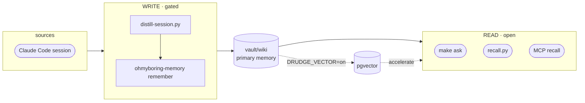

# ohmyboring

[English](README.md) · **한국어** · [日本語](README.ja.md)

[](https://github.com/jazz1x/ohmyboring/actions/workflows/ci.yml)

[](LICENSE)


**셀프호스팅 개인 메모리 RAG.** Claude Code 세션이 로컬의 사람이 읽는 위키로 증류돼 쌓이고, *"전에 이거 어떻게 했더라"* 를 다시 꺼내 쓴다. **클라우드 0 · 100% 로컬.**

```bash
# 가장 빠름 — 원라이너: ~/oh-my-boring에 클론, 빌드, Claude Code 훅까지 연결.
sh -c "$(curl -fsSL https://raw.githubusercontent.com/jazz1x/ohmyboring/main/install.sh)"
```

또는 단계별로:

```bash
git clone https://github.com/jazz1x/ohmyboring.git ~/oh-my-boring
cd ~/oh-my-boring
make up
make ask Q="docker build cache 문제 어떻게 고쳤더라?"
```

> **Docker**, **Ollama**(또는 OpenAI-compatible 서버), **Python 3**, **jq**, **curl**가 필요합니다.

---

## 기능

1. **자동 축적** — 세션이 끝나면 `vault/wiki`에 정리된 마크다운 노트로 변환됩니다. 수동 관리 불필요.
2. **마크다운 중심 메모리** — 일반 텍스트, 사람이 읽기 쉬움, git diff 가능. 검색도 마크다운을 직접 읽습니다.
3. **로컬 전용** — 임베딩과 요약이 Ollama 등 로컬 LLM에서 실행됩니다. 외부 API나 토큰 없음.

선택적으로 **pgvector** 가속기(`DRUDGE_VECTOR=on`)를 켜면 유사도 검색 + GraphRAG이 추가됩니다.

---

## 내 메모리 보기

노트는 그냥 마크다운이므로, **`vault/` 폴더를 [Obsidian](https://obsidian.md) 보관함(vault)으로 열면** 그래프 뷰, 백링크, 태그, 전문 검색을 그대로 쓸 수 있습니다. 컴파일된 노트에는 이미 Obsidian-safe `tags`와 `[[wiki-NNNN]]` `relates_to` 링크가 들어 있어, 그래프 뷰가 메모리의 연결 관계를 바로 그려 줍니다(`DRUDGE_VECTOR=on`일 때 GraphRAG 그래프가 이 링크로 투영되어 가장 풍부합니다). 별도 UI를 만들 필요가 없습니다. Obsidian이 만드는 `.obsidian/` 작업 폴더는 gitignore 처리되어, 내 레이아웃이 로컬에만 남고 git에 새지 않습니다.

---

## 아키텍처



- **Read door** — 빠르고 LLM 불필요. `make ask`, `recall.py`, MCP `recall`이 `vault/wiki`를 직접 읽습니다.
- **Write door** — gated. `distill-session.py`가 로컬 LLM을 호출하고 ohmyboring-memory의 `remember` MCP tool로 기록합니다.

---

## 설정

정책은 **`boring.json`**(`make up` 시 `boring.example.json`에서 생성)에:

```json
{
  "$schema": "https://raw.githubusercontent.com/jazz1x/ohmyboring/main/boring.schema.json",
  "schema_version": 1,
  "note_lang": "auto",
  "repos": [
    {"match": "your-company", "origin": "company", "name": "your-company"},
    {"match": "~/code", "origin": "personal", "name": "mine"}
  ],
  "agents": [
    {"id": "claude-code", "enabled": true, "format": "claude-json", "paths": ["~/.claude/projects"]}
  ]
}
```

| Key | 용도 |
|---|---|
| `note_lang` | `auto` · `ko` · `en` |
| `repos[]` | 경로/remote 규칙 → `origin=personal/company/mirror/community` |
| `agents[]` | vector mode ingest source |

시크릿/런타임 스위치는 **`.env`**:

| Variable | 용도 |
|---|---|
| `DRUDGE_VECTOR` | `on` 시 pgvector 활성화(선택) |
| `DRUDGE_LLM_BASE_URL` | OpenAI-compatible endpoint, Docker 기본값 `http://host.docker.internal:11434/v1` · Native 모드는 `http://localhost:11434/v1` |
| `DRUDGE_LLM_MODEL` / `DRUDGE_EMBED_MODEL` | 기본 `gemma4:12b` / `bge-m3` |
| `SLACK_APP_TOKEN` / `SLACK_BOT_TOKEN` | 선택적 Slack assistant |

> **임베딩 모델을 바꾸면 벡터 차원이 바뀝니다.** 합성 모델(`DRUDGE_LLM_MODEL`)은 자유롭게 교체해도 되지만, `DRUDGE_EMBED_MODEL`을 바꾸면 크기가 다른 벡터가 나오므로, `boring.json`의 `embed_dim`을 맞게 수정하고 **그리고** `make reset`을 실행해야 합니다 — 그러지 않으면 기존 형태의 벡터에 대한 upsert가 실패합니다. 흔한 차원: `bge-m3` = 1024 · OpenAI `text-embedding-3-small` = 1536 · `nomic-embed-text` = 768.

---

## 명령어

| Command | 설명 |
|---|---|
| `make up` | ohmyboring-memory 엔진 실행(hermes-agent 이미지가 있을 때만 함께 실행) |
| `make ollama` | Ollama 실행 확인(필요시 백그라운드 시작) |
| `make ask Q="..."` | recall + 요약 한 번에 |
| `make sync` | vault 재적재 |
| `make remember M="text"` | 한 줄 노트 작성 |
| `make collect [N=1]` | 과거 세션 lazy 백필 |
| `make hermes-build` | 선택적 hermes-agent 이미지 클론/빌드 |
| `make smoke` | end-to-end smoke test |
| `make logs` | 엔진 로그 |
| `make guard` | fmt + clippy + test + Python py-compile |
| `make down` | 컨테이너 중지 |

---

## 에이전트 어댑터

`agents/`는 외부 에이전트를 ohmyboring-memory 엔진에 연결하는 **호스트측 어댑터**입니다. 모든 어댑터는 동일한 MCP/HTTP 표면을 통해 ohmyboring-memory와 통신하며, 모두 선택 사항입니다.

기존 `hooks/` 경로는 backward-compatible symlink 세트로 남아 있어, 기존 Claude Code `settings.json` 항목과 cron job이 깨지지 않습니다.

| 어댑터 | 경로 | 소비 주체 | 진입점 | 역할 |
|---|---|---|---|---|
| Claude Code | `agents/claude-code/distill-session.py` | `SessionEnd` / `Stop` hook | 세션을 요약해 `remember` 호출 |
| Claude Code | `agents/claude-code/recall.py` | `UserPromptSubmit` hook | 관련 snippet을 가져와 프롬프트 context 주입 |
| Cursor | `agents/cursor/README.md` | MCP only | `~/.cursor/mcp.json` | `ohmyboring-memory`를 MCP 서버로 노출 |
| Codex | `agents/codex/README.md` | MCP only | `~/.codex/mcp.json` | `ohmyboring-memory`를 MCP 서버로 노출 |
| hermes-agent | `agents/hermes/ingest-worker.py` | `hermes cron --script` | cron tick마다 한 세션씩 백필 |
| scheduler | `agents/schedulers/collect-sessions.py` | cron / launchd / 수동 | 오래된 세션 lazy 백필 |
| shared | `agents/shared/boring_config.py` | 어댑터 import | `boring.json` 정책 로더 |
| shared | `agents/shared/agent_wiring.py` | `install.sh` | 활성화된 에이전트의 hook/MCP 설정을 idempotent하게 구성 |

### 토큰 예산

자동 검색은 에이전트의 context window를 폭발시킬 수 있으므로, 검색 표면은 예산을 인식합니다.

- MCP `recall`은 `max_tokens`, `max_results`를 받습니다.
- HTTP `/search`는 `max_tokens`, `max_results`를 받습니다.
- `recall.py`는 `RECALL_MAX_TOKENS` / `RECALL_MAX_RESULTS`로 주입 context를 제한합니다.
- `ask`/`brief` 합성은 검색된 context를 고정 문자 한도 아래로 유지합니다.

### 다른 에이전트

MCP를 지원하는 어떤 에이전트도 ohmyboring-memory를 사용할 수 있습니다. 이 repo는 Claude Code, Cursor, Windsurf, Claude Desktop이 모두 읽는 표준 **`.mcp.json`**(root key `mcpServers`)을 제공합니다:

```json
{ "mcpServers": { "ohmyboring-memory": { "type": "http", "url": "http://localhost:7700/mcp" } } }
```

`install.sh`는 `boring.json`에서 Cursor와 Codex가 활성화되어 있을 때 Cursor의 `~/.cursor/mcp.json`과 Codex의 `~/.codex/mcp.json`도 자동으로 작성합니다.

(VS Code Copilot은 root key `servers`를 쓰는 `.vscode/mcp.json`을 사용합니다. CLI 대안: `claude mcp add --transport http --scope project ohmyboring-memory http://localhost:7700/mcp`. compose sibling 컨테이너는 `http://ohmyboring:7700/mcp`로 접근합니다.)

사용 가능한 tools (10개): `recall` · `neighbors` · `claims`(검색) · `ask` · `brief`(생성 — LLM 실행) · `corpus_status` · `config_get`(introspection) · `remember` · `classify_repo` · `sync`(쓰기 / 유지보수).

기본 wiki-first 모드(`DRUDGE_VECTOR=off`)에서는 네 개 tool이 pgvector 백엔드를 필요로 하며, `DRUDGE_VECTOR=on`을 설정하기 전까지 JSON-RPC `-32603`을 반환합니다: `neighbors`, `claims`, `corpus_status`, `brief`. 나머지 여섯 개(`recall`, `ask`, `remember`, `sync`, `config_get`, `classify_repo`)는 `vault/wiki`를 직접 사용합니다.

- `neighbors` *(`DRUDGE_VECTOR=on` 필요)* — 토픽에서 출발하는 그래프 순회: 쿼리를 임베딩해 가장 가까운 노트 하나를 잡고, 그 노트의 1-hop 라벨을 반환합니다(`{hit, graph_neighbors, semantic_neighbors}` JSON). `hit`은 매칭된 노트 경로, `graph_neighbors`는 그 노트의 project/topic 라벨, `semantic_neighbors`는 공유 tool/concept 라벨이며 — 노트 경로가 아니라 평탄한 문자열입니다.
- `claims` *(`DRUDGE_VECTOR=on` 필요)* — 쿼리 근처의 현재(미대체) `{subject, predicate, value}` 결정 top-k.
- `corpus_status` *(`DRUDGE_VECTOR=on` 필요)* — KB 상태 스냅샷(파일/청크 수, origin/kind/project별, 오염도, graph/semantic 노드+엣지).
- `ask` / `brief` — 유일하게 LLM을 돌리는 tool: `ask`는 출처를 인용해 질문에 답하고(wiki-first 모드에서 동작), `brief` *(`DRUDGE_VECTOR=on` 필요)* 는 최신순 우선 업무 브리핑입니다.

구조화 tool(`neighbors`, `claims`, `corpus_status`, `config_get`, `ask`, `brief`)은 텍스트 블록과 함께 네이티브 `structuredContent`(JSON)를 반환하고, 산문/ack tool(`recall`, `remember`, `sync`, `classify_repo`)은 텍스트를 반환합니다.

MCP 호출 예시 (HTTP 위의 raw JSON-RPC):

```bash
curl -s -X POST http://localhost:7700/mcp \
  -H 'content-type: application/json' \
  -d '{
    "jsonrpc": "2.0",
    "id": 1,
    "method": "tools/call",
    "params": {
      "name": "recall",
      "arguments": {
        "query": "docker build cache fix",
        "max_tokens": 1500,
        "max_results": 3
      }
    }
  }' | jq .
```

### 선택사항: hermes-agent

[hermes-agent](https://hermes-agent.org)는 서드파티 자율 supervisor입니다. Slack, 오케스트레이션, cron 기반 백필을 ohmyboring-memory의 MCP 백엔드로 구동할 수 있습니다. 이미지를 별도로 빌드하면 `make up`이 자동으로 감지합니다.

설정은 hermes-agent 프로젝트의 **자체 문서** 기준입니다(여기서는 범위 밖) — `~/.hermes/config.yaml`을 ohmyboring-memory의 MCP(`http://ohmyboring:7700/mcp`)로 향하게 하면 됩니다. ohmyboring이 제공하는 구성은 이를 Slack assistant로 연결하는 것까지이며, 그 이상으로 쓰려면 이미지를 직접 빌드하거나 수정하세요.

---

## 배포

| Mode | 방법 |
|---|---|
| **Docker** (기본) | `make up` |
| **Native** | `cd drudge && DRUDGE_VAULT_DIR="$PWD/../vault" DRUDGE_HTTP_ADDR=127.0.0.1:7700 cargo run --release -- serve` |

> Native `serve`는 `DRUDGE_VAULT_DIR`가 필요합니다 — 없으면 `remember`가 `DRUDGE_VAULT_DIR not set`으로 실패합니다. 또한 기본값으로 `0.0.0.0:7700`에 바인딩하므로, loopback으로만 열려면 `DRUDGE_HTTP_ADDR=127.0.0.1:7700`을 설정하세요.

---

## 개발 · 가드레일

- SSOT 문서: `drudge/{PHILOSOPHY,RUST-STYLE,ENFORCEMENT}.md`
- `make guard` = `rustfmt --check` + `clippy -D warnings` + `cargo test`
- CI: `rust-gate` · `gitleaks` · `cargo-deny` · `trivy`
- `unsafe_code = "forbid"`

---

## 문제 해결

| 증상 | 해결 |
|---|---|
| `make up` 실패 | Ollama 확인: `curl -sf http://127.0.0.1:11434/api/tags` |
| 포트 충돌 | `lsof -i :7700 -i :5432 -i :11434` |
| 두 번째 `make up` / 재클론 실패 | 먼저 `make down`을 실행하세요 — 컨테이너 이름이 고정이고 `127.0.0.1:7700` / `:5432`에 바인딩하므로, 두 번째 스택이 실행 중인 스택과 충돌합니다 |
| agent 시작 안 됨 | `OMB_CORE_ONLY=1 make up`로 core-only 실행. hermes 이미지는 별도 빌드 필요 |
| Linux: 컨테이너가 호스트 Ollama에 접근 못 함 | Linux에서는 Ollama가 기본적으로 `127.0.0.1`에 바인딩하므로, `host.docker.internal`이 해석되더라도 컨테이너는 닫힌 포트에 부딪힙니다. Ollama를 모든 인터페이스에 바인딩하고(`OLLAMA_HOST=0.0.0.0:11434` 후 재시작) 그리고/또는 호스트 방화벽에서 docker 브리지를 허용하세요 |
| 정상인가? / 마지막 distill이 됐나? | `make doctor` — 빠른 상태 + 마지막 적재 점검 |

---

## Ollama 계속 켜두기

`make up`은 Ollama가 안 켜져 있으면 시작하지만, 나중에 꺼지면 다음 세션 적재가 실패합니다.

- 빠른 확인/시작: `make ollama`
- 재부팅 후에도 유지 (macOS):
  ```bash
  brew services start ollama
  ```
- 또는 지속 터미널에서: `ollama serve`

## 주기적 sync

엔진은 4시간마다 deterministic sync를 예약하지만, `vault/wiki/`를 수동으로 수정하거나 vector/graph 데이터를 더 자주 최신화하려면:

```bash
make sync
```

자동 sync를 원하면 cron 추가:

```bash
# 매시간
0 * * * * cd ~/oh-my-boring && make sync >/tmp/omb-sync.log 2>&1
```

---

## 디렉토리

```text
oh-my-boring/
├─ drudge/                  # Rust 엔진
├─ agents/                  # 호스트측 에이전트 어댑터
│  ├─ claude-code/          # Claude Code hooks
│  ├─ hermes/               # hermes-agent cron
│  ├─ schedulers/           # cron/launchd 백필
│  └─ shared/               # 정책/설정 라이브러리
├─ hooks/                   # backward-compatible symlink → agents/
├─ scripts/                 # guard.sh · smoke.sh
├─ vault/                   # raw → wiki 메모리
├─ data/                    # Postgres 데이터 (gitignored)
├─ docker-compose.yml
├─ start.sh
├─ boring.json              # 정책 (make up 시 생성)
└─ Makefile
```

> **vault/wiki ID 안내:** `wiki-0000.md`는 repo에 포함된 샘플 노트입니다. 개인 노트는 `wiki-0001.md`부터 시작하며 gitignore 처리되어 private 내용이 git에 섞이지 않습니다.
>
> **플랫폼 안내:** macOS와 Linux에서 테스트되었습니다. `hooks/`가 backward-compatible symlink를 사용하므로 Windows는 아직 공식 지원하지 않습니다.
