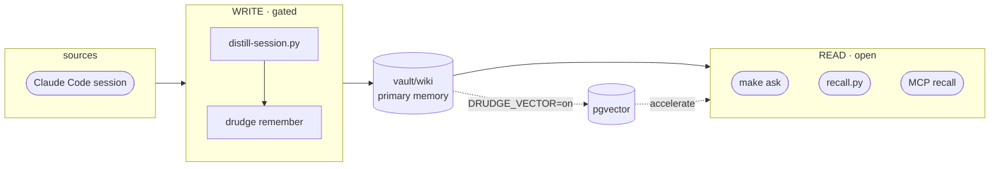

# oh-my-boring

[English](README.md) · **한국어** · [日本語](README.ja.md)

[](https://github.com/jazz1x/oh-my-boring/actions/workflows/ci.yml)


**셀프호스팅 개인 메모리 RAG.** Claude Code 세션이 로컬의 사람이 읽는 위키로 증류돼 쌓이고, *"전에 이거 어떻게 했더라"* 를 다시 꺼내 쓴다. **클우드 0 · 100% 로컬.**

```bash
git clone https://github.com/jazz1x/oh-my-boring.git ~/oh-my-boring
cd ~/oh-my-boring
make up
make ask Q="docker build cache 문제 어떻게 고쳤더라?"
```

> **Docker**, **Ollama**(또는 OpenAI-compatible 서버), **Python 3**, **jq**가 필요합니다.

---

## 기능

1. **자동 축적** — 세션이 끝나면 `vault/wiki`에 정리된 마크다운 노트로 변환됩니다. 수동 관리 불필요.
2. **마크다운 중심 메모리** — 일반 텍스트, 사람이 읽기 쉬움, git diff 가능. 검색도 마크다운을 직접 읽습니다.
3. **로컬 전용** — 임베딩과 요약이 Ollama 등 로컬 LLM에서 실행됩니다. 외부 API나 토큰 없음.

선택적으로 **pgvector** 가속기(`DRUDGE_VECTOR=on`)를 켜면 유사도 검색 + GraphRAG이 추가됩니다.

---

## 아키텍처



- **Read door** — 빠르고 LLM 불필요. `make ask`, `recall.py`, MCP `recall`이 `vault/wiki`를 직접 읽습니다.
- **Write door** — gated. `distill-session.py`가 로컬 LLM을 호출하고 drudge의 `remember` MCP tool로 기록합니다.

---

## 설정

정책은 **`boring.json`**(`make up` 시 `boring.example.json`에서 생성)에:

```json
{
  "$schema": "https://raw.githubusercontent.com/jazz1x/oh-my-boring/main/boring.schema.json",
  "note_lang": "auto",
  "repos": [
    {"match": "marketboro", "origin": "company", "name": "marketboro"},
    {"match": "jongyun/Development/mine", "origin": "personal", "name": "mine"}
  ],
  "agents": ["claude-code"]
}
```

| Key | 용도 |
|---|---|
| `note_lang` | `auto` · `ko` · `en` |
| `repos[]` | 경로/remote 규칙 → `origin=personal/company/mirror/community` |
| `agents[]` | vector mode ingest source |

시크릿/런타임 스위치는 **`.env`**:

| Variable | 용도 |
|---|---|
| `DRUDGE_VECTOR` | `on` 시 pgvector 활성화(선택) |
| `DRUDGE_LLM_BASE_URL` | OpenAI-compatible endpoint, 기본 `http://localhost:11434/v1` |
| `DRUDGE_LLM_MODEL` / `DRUDGE_EMBED_MODEL` | 기본 `gemma4:12b` / `bge-m3` |
| `SLACK_APP_TOKEN` / `SLACK_BOT_TOKEN` | 선택적 Slack assistant |

---

## 명령어

| Command | 설명 |
|---|---|
| `make up` | drudge 실행(hermes-agent 이미지가 있을 때만 함께 실행) |
| `make ask Q="..."` | recall + 요약 한 번에 |
| `make sync` | vault 재적재 |
| `make remember M="text"` | 한 줄 노트 작성 |
| `make smoke` | end-to-end smoke test |
| `make logs` | drudge 로그 |
| `make guard` | fmt + clippy + test |
| `make down` | 컨테이너 중지 |

---

## 에이전트 어댑터

`agents/`는 외부 에이전트를 drudge 엔진에 연결하는 **호스트측 어댑터**입니다. 모든 어댑터는 동일한 MCP/HTTP 표면을 통해 drudge와 통신하며, 모두 선택 사항입니다.

기존 `hooks/` 경로는 backward-compatible symlink 세트로 남아 있어, 기존 Claude Code `settings.json` 항목과 cron job이 깨지지 않습니다.

| 어댑터 | 경로 | 소비 주체 | 진입점 | 역할 |
|---|---|---|---|---|
| Claude Code | `agents/claude-code/distill-session.py` | `SessionEnd` / `Stop` hook | 세션을 요약해 `remember` 호출 |
| Claude Code | `agents/claude-code/recall.py` | `UserPromptSubmit` hook | 관련 snippet을 가져와 프롬프트 context 주입 |
| hermes-agent | `agents/hermes/ingest-worker.py` | `hermes cron --script` | cron tick마다 한 세션씩 백필 |
| scheduler | `agents/schedulers/collect-sessions.py` | cron / launchd / 수동 | 오래된 세션 lazy 백필 |
| shared | `agents/shared/boring_config.py` | 어댑터 import | `boring.json` 정책 로더 |

### 토큰 예산

자동 검색은 에이전트의 context window를 폭발시킬 수 있으므로, 검색 표면은 예산을 인식합니다.

- MCP `recall`은 `max_tokens`, `max_results`를 받습니다.
- HTTP `/search`는 `max_tokens`, `max_results`를 받습니다.
- `recall.py`는 `RECALL_MAX_TOKENS` / `RECALL_MAX_RESULTS`로 주입 context를 제한합니다.
- `ask`/`brief` 합성은 검색된 context를 고정 문자 한도 아래로 유지합니다.

### 다른 에이전트

MCP를 지원하는 어떤 에이전트도 drudge를 사용할 수 있습니다. MCP server 등록:

```yaml
mcp_servers:
  drudge:
    url: http://drudge:7700/mcp
    transport: http
```

사용 가능한 tools: `recall` · `remember` · `sync` · `config_get` · `classify_repo`.

MCP 호출 예시 (HTTP 위의 raw JSON-RPC):

```bash
curl -s -X POST http://localhost:7700/mcp \
  -H 'content-type: application/json' \
  -d '{
    "jsonrpc": "2.0",
    "id": 1,
    "method": "tools/call",
    "params": {
      "name": "recall",
      "arguments": {
        "query": "docker build cache fix",
        "max_tokens": 1500,
        "max_results": 3
      }
    }
  }' | jq .
```

### 선택사항: hermes-agent

[hermes-agent](https://hermes-agent.org)는 서드파티 자율 supervisor입니다. Slack, 오케스트레이션, cron 기반 백필을 drudge의 MCP 백엔드로 구동할 수 있습니다. 이미지를 별도로 빌드하면 `make up`이 자동으로 감지합니다.

---

## 배포

| Mode | 방법 |
|---|---|
| **Docker** (기본) | `make up` |
| **Native** | `cd drudge && cargo run --release -- serve` |

---

## 개발 · 가드레일

- SSOT 문서: `drudge/{PHILOSOPHY,RUST-STYLE,ENFORCEMENT}.md`
- `make guard` = `rustfmt --check` + `clippy -D warnings` + `cargo test`
- CI: `rust-gate` · `gitleaks` · `cargo-deny` · `trivy`
- `unsafe_code = "forbid"`

---

## 문제 해결

| 증상 | 해결 |
|---|---|
| `make up` 실패 | Ollama 확인: `curl -sf http://127.0.0.1:11434/api/tags` |
| 포트 충돌 | `lsof -i :7700 :5432 :11434` |
| agent 시작 안 됨 | `OMB_CORE_ONLY=1 make up`로 core-only 실행. hermes 이미지는 별도 빌드 필요 |

---

## 디렉토리

```text
oh-my-boring/
├─ drudge/                  # Rust 엔진
├─ agents/                  # 호스트측 에이전트 어댑터
│  ├─ claude-code/          # Claude Code hooks
│  ├─ hermes/               # hermes-agent cron
│  ├─ schedulers/           # cron/launchd 백필
│  └─ shared/               # 정책/설정 라이브러리
├─ hooks/                   # backward-compatible symlink → agents/
├─ scripts/                 # guard.sh · smoke.sh
├─ vault/                   # raw → wiki 메모리
├─ data/                    # Postgres 데이터 (gitignored)
├─ docker-compose.yml
├─ start.sh
├─ boring.json              # 정책 (make up 시 생성)
└─ Makefile
```

> **vault/wiki ID 안내:** `wiki-0000.md`는 repo에 포함된 샘플 노트입니다. 개인 노트는 `wiki-0001.md`부터 시작하며 gitignore 처리되어 private 내용이 git에 섞이지 않습니다.
