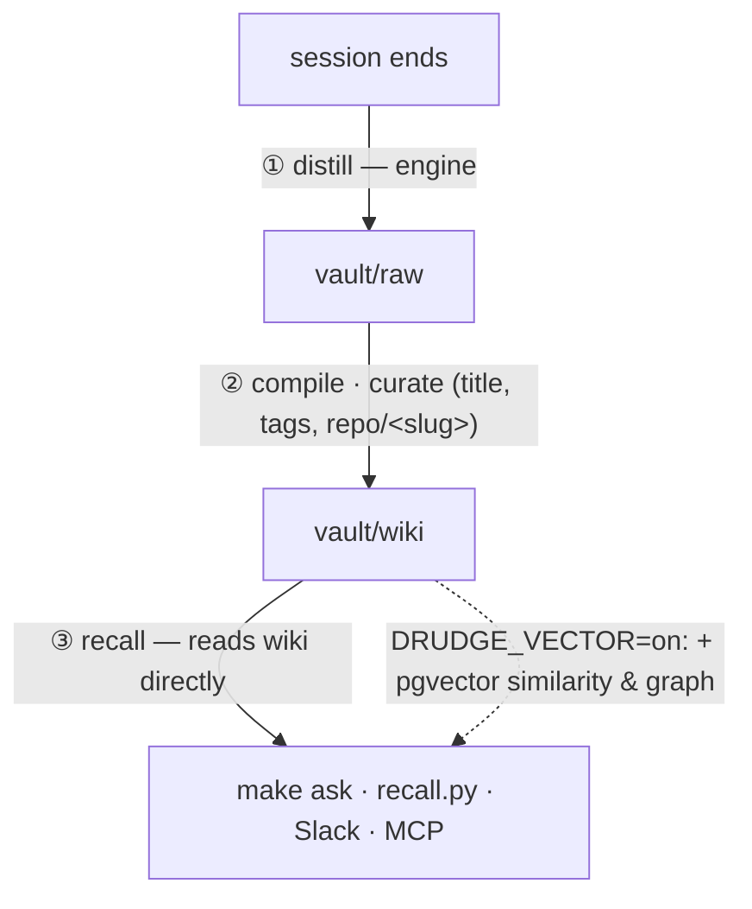

# oh-my-boring

**English** · [한국어](README.ko.md) · [日本語](README.ja.md)

[](https://github.com/jazz1x/oh-my-boring/actions/workflows/ci.yml)


**Self-hosted personal memory RAG.** Your work in Claude Code (or any markdown notes) is distilled into a local, human-readable wiki and recalled on demand — *"how did I do this last time?"* **Zero cloud · 100% local.**

> The boring chore you keep skipping — remembering past work and digging it back up — is what the **drudge** engine quietly does for you.

```mermaid
flowchart LR
  subgraph SRC ["sources"]
    direction TB
    CC(["Claude Code session"])
    NT(["markdown notes"])
  end
  subgraph WRITE ["WRITE · gated — engine, or agent (opt-in)"]
    direction LR
    D["distill"] --> RAW["vault/raw"] --> CP["compile · curate"]
  end
  WIKI[("vault/wiki<br/>★ primary memory")]
  subgraph RD ["READ · open · fast"]
    direction TB
    ASK(["make ask"])
    REC(["recall.py"])
    SLK(["Slack"])
    MCP(["MCP recall"])
  end
  SRC --> WRITE --> WIKI --> RD
  WIKI -. "DRUDGE_VECTOR=on" .-> PG[("pgvector<br/>vector + graph RAG")]
  PG -. accelerate .-> RD
  classDef hub fill:#ffe9a8,stroke:#c79a00,stroke-width:2px;
  classDef opt fill:#eaf0ff,stroke:#5a78c0,stroke-dasharray:5 3;
  class WIKI hub;
  class PG opt;
```



**vault/wiki markdown is the primary memory** — the agent and engine read it directly (no embeddings needed). pgvector (vector + graph RAG) is an **optional accelerator** you switch on when you want it.

---

## Why

- **Auto-accumulation** — when a session ends, it's distilled into a "problem-solving narrative" and curated into `vault/wiki`. No manual upkeep.
- **Markdown-first** — memory is plain, human-readable, git-diffable markdown you can read and edit. Recall reads it directly (the Karpathy "LLM wiki" approach; simplest thing that works at personal scale).
- **Local-only** — embedding/synthesis run on a local OpenAI-compatible LLM server (Ollama by default). Zero external APIs/tokens.
- **Optional vector + graph** — flip `DRUDGE_VECTOR=on` for pgvector similarity + GraphRAG (problem/solution/tool/concept nodes) when scale or precision calls for it.

---

## Layers

| # | Layer | Role | Default in `make up` |
|---|---|---|:---:|
| 1 | **LLM server** (host, OpenAI-compatible) | embedding `bge-m3` · synthesis `gemma4:12b` — Ollama default, swap for LM Studio/vLLM via `DRUDGE_LLM_BASE_URL` | required[^llm] |
| 2 | **drudge** (Rust engine) | distill · compile (raw→wiki) · recall · serve (HTTP + MCP + scheduler) | ✓ |
| 3 | **vault/wiki** (markdown) | the primary memory — curated notes, read directly | ✓ (files) |
| 4 | **hooks** (host, Python) | session→engine glue (distill · recall · collect) | manual install[^hooks] |
| 5 | **hermes-agent** (the brain) | autonomous agent driving ingest/recall/skills (MCP) | ✓[^agent] |
| 6 | **Postgres + pgvector** | vector (HNSW) + BM25 + graph — **optional** accelerator | ✗ (`--profile vector`)[^vec] |

[^llm]: An OpenAI-compatible `/v1` server on the host (default `ollama serve`). Point elsewhere with `DRUDGE_LLM_BASE_URL` (e.g. LM Studio `:1234/v1`).
[^hooks]: Register in `~/.claude/settings.json` — see [Self-augmentation loop](#self-augmentation-loop).
[^agent]: Third-party image (Nous Hermes Agent), not bundled — build it first ([Prerequisites](#prerequisites)). `start.sh` stops with a hint if missing.
[^vec]: Off by default (wiki is primary). Enable with `DRUDGE_VECTOR=on` + `docker compose --profile vector up` (brings up Postgres).

> Core = LLM (1) + drudge (2) + wiki files (3). Hooks (4) drive auto-capture; the agent (5) is the brain; pgvector (6) is opt-in.

---

## Two doors (read / write)

Reads and writes are asymmetric, so they use different doors:

- **Read door (open, fast)** — recall reads `vault/wiki` directly (~ms, no LLM loop, safe to expose widely). Used by `recall.py`, `make ask`, MCP `recall`, Slack. Reads never need the agent.
- **Write door (gated)** — accumulation is judged: is this worth keeping, how to curate? The **engine** distills + gates (deterministic, reliable). Opt into `DRUDGE_VECTOR=on` for vector storage; the agent is an optional supervisor, not a required write door.

---

## Prerequisites

| Install | Purpose | Check |
|---|---|---|
| **Docker** (Compose v2) | container stack | `docker compose version` |
| **LLM runtime** (OpenAI-compatible) | local embedding/synthesis | default **Ollama** ([ollama.com](https://ollama.com) / `brew install ollama`). LM Studio/vLLM also work |
| **Python 3** | host hooks | `python3 --version` (ships with macOS) |
| **jq** | `make ask`/`sync`/`smoke` parse JSON | `jq --version` · `brew install jq` |
| _(optional)_ **hermes-agent image** | the autonomous agent — **not required**; `make up` runs core-only without it | see [Connecting Nous Hermes Agent](#connecting-nous-hermes-agent) |
| ~10GB disk | two models | `gemma4:12b` (~8GB) + `bge-m3` (~1.2GB) — `make up`/`make models` pulls them |

> **Clone location**: `~/oh-my-boring` recommended (hook/`start.sh`/vault paths assume it).

---

## Quick start

```bash
git clone https://github.com/jazz1x/oh-my-boring.git ~/oh-my-boring
cd ~/oh-my-boring
make up                       # creates .env if needed, checks Ollama, pulls models, builds, starts
make ask Q="how did I fix the docker build cache problem?"
```

> `make up` creates `.env` from `.env.example` and `boring.json` from `boring.example.json` automatically if absent. Edit `.env` only for Slack tokens or a non-default LLM endpoint. Edit `boring.json` for note language, repo rules, and source directories. If you have GitHub SSH keys set up, the SSH URL `git@github.com:jazz1x/oh-my-boring.git` also works.
>
> If you clone to a directory other than `~/oh-my-boring`, set `export OMB_HOME=/your/path` so hooks and scripts resolve vault paths correctly.

`make up` (wiki default) starts **drudge** — hermes-agent joins automatically if its image exists, otherwise startup falls back to core-only (so `make ask` works without the agent). Postgres is only started when vector mode is enabled.

---

## Self-augmentation loop

When a session ends it accumulates on its own — the core value.



| Hook | Claude Code event | What it does |
|---|---|---|
| `hooks/distill-session.py` | `SessionEnd` / `Stop` | distill session → vault/raw via the local LLM (engine) |
| `hooks/recall.py` | `UserPromptSubmit` | recall relevant past work and inject it as context |
| `hooks/collect-sessions.py` | cron / `make collect` | backfill sessions missed by SessionEnd |

**Install** (persist) — `~/.claude/settings.json`:

```jsonc
{
  "hooks": {
    "SessionEnd": [
      { "type": "command", "command": "python3 ~/oh-my-boring/hooks/distill-session.py", "timeout": 130, "async": true }
    ],
    "UserPromptSubmit": [
      { "type": "command", "command": "python3 ~/oh-my-boring/hooks/recall.py", "timeout": 10 }
    ]
  }
}
```

> The engine (drudge) must be up for distill/recall. If not, they silently no-op — a session is never blocked.

---

## Connecting Nous Hermes Agent

> ⚠️ `~/.hermes` may contain credentials and session memory. Only build/run the hermes-agent image from a source you trust, and keep `~/.hermes` restrictive (`chmod 700 ~/.hermes`).

drudge is the agent's **MCP memory backend**. The agent (brain) drives; drudge (hands) does the mechanics.

1. **Build the image from the upstream source** (the image is not in this repo):
   ```bash
   git clone https://github.com/NousResearch/hermes-agent.git ~/hermes-agent-src
   cd ~/hermes-agent-src
   docker build -t hermes-agent .
   ```
   If the upstream repo/tag differs, adjust the clone URL and ensure the final image tag is `hermes-agent` (matching `docker-compose.yml`).
2. **Create the agent data directory** with the right ownership:
   ```bash
   mkdir -p ~/.hermes
   chmod 700 ~/.hermes
   export HERMES_UID=$(id -u) HERMES_GID=$(id -g)
   # Persist for compose:
   echo "HERMES_UID=$HERMES_UID" >> .env
   echo "HERMES_GID=$HERMES_GID" >> .env
   ```
3. **Register drudge as an MCP server** in `~/.hermes/config.yaml`:
   ```yaml
   mcp_servers:
     drudge:
       # This address is resolved inside the compose network by the agent container.
       # To test from the host, use http://127.0.0.1:7700/mcp instead.
       url: http://drudge:7700/mcp
       transport: http
   ```
4. Run `make up` again. The agent now starts alongside drudge.
5. **Verify the connection**:
   ```bash
   # drudge MCP surface
   curl -s -X POST http://127.0.0.1:7700/mcp \
     -H 'content-type: application/json' \
     -d '{"jsonrpc":"2.0","id":1,"method":"tools/list"}' | jq .
   # agent logs
   make agent-logs
   ```

MCP tools exposed by drudge (`/mcp`): `recall{query}` (read), `remember{text,title?}` (write a note), `sync{}` (compile → ingest), `config_get{}` (read policy), `classify_repo{cwd,remote_url?}` (propose repo origin).

If the agent image is missing, `make up` falls back to core-only and prints a build hint. Set `OMB_CORE_ONLY=1` to skip the agent intentionally.

---

## Deployment: Docker / native

| Mode | How | When |
|---|---|---|
| **Docker** (default) | `make up` — drudge + hermes-agent (+ Postgres with `DRUDGE_VECTOR=on`) | simplest |
| **Native** | `cd drudge && cargo run --release -- serve` | no containers / dev. Set env: `DRUDGE_LLM_BASE_URL`, `DRUDGE_VAULT_DIR` (+ `PG_DSN` if vector), and create `boring.json` for policy. drudge is a single static binary |

---

## Command reference

`make help` for all. Common:

| Command | Description |
|---|---|
| `make up` | set up + start (wiki mode; `DRUDGE_VECTOR=on` for vector) |
| `make ask Q="question"` | one-shot query (recall + synthesis + sources) |
| `make sync` | distill/compile cycle (+ ingest/graph when vector on) |
| `make remember M="text"` | write a one-line note |
| `make smoke` | end-to-end smoke test |
| `make logs` | drudge engine logs |
| `make guard` | structural gate (fmt + clippy + test) — same as CI |
| `make deny` | supply-chain gate (cargo-deny) |
| `make down` | stop (keeps `./data`) |
| `make reset` | ⚠️ wipe Postgres data (re-ingested from sources) |
| `make agent-logs` | hermes-agent logs (MCP connection diagnostics) |

---

## Troubleshooting

### `make up` fails
1. Check Ollama: `curl -sf http://127.0.0.1:11434/api/tags`
2. Check ports: `lsof -i :7700 ; lsof -i :5432 ; lsof -i :11434`
3. View logs: `make logs`, `make agent-logs`, `tail -f /tmp/ollama.log`
4. Run core-only to isolate the agent: `OMB_CORE_ONLY=1 make up`

### Ollama / model pull issues
- Ensure `OLLAMA_HOST` in `.env` matches the host bind (default `http://127.0.0.1:11434`).
- Pull manually: `ollama pull gemma4:12b && ollama pull bge-m3`.
- Models need ~10 GB free disk; first pull can take several minutes.

### Permission / port conflicts
- If you ran with `sudo`, fix ownership: `sudo chown -R $(id -u):$(id -g) .env vault data`.
- If Postgres port `5432` conflicts, edit `docker-compose.yml` `postgres.ports` to `127.0.0.1:15432:5432`.

### Agent connection fails
1. `docker compose ps` — `boring-agent` must be `Up`.
2. `make agent-logs` — look for MCP registration errors.
3. Test MCP from the host: `curl -s -X POST http://127.0.0.1:7700/mcp -H 'content-type: application/json' -d '{"jsonrpc":"2.0","id":1,"method":"tools/list"}' | jq .`
4. Verify `~/.hermes/config.yaml` path and indentation.

---

## Configuration

Policy lives in **`boring.json`** (created from `boring.example.json` by `make up`).

| Key | Default | Purpose |
|---|---|---|
| `note_lang` | `auto` | output language for distill/compile: `ko`, `en`, or `auto` (follow source) |
| `repos[]` | `[]` | path/remote rules that tag content `origin=personal/company/mirror/community` |
| `agents[]` | `[{enabled:true, paths:["~/.claude/projects", "vault/wiki"]}]` | ingest sources (vector mode) |

`.env` is only for secrets and runtime switches (Slack tokens, LLM endpoint/model, `DRUDGE_VECTOR`, `HERMES_UID/GID`).

| Variable | Default | Purpose |
|---|---|---|
| `DRUDGE_VECTOR` | `off` | `on` enables pgvector (vector + graph RAG); off = wiki-only |
| `DRUDGE_LLM_BASE_URL` | `http://localhost:11434/v1` | OpenAI-compatible LLM server (Ollama · LM Studio · …) |
| `DRUDGE_LLM_API_KEY` | — | only for providers needing auth |
| `DRUDGE_LLM_MODEL` / `DRUDGE_EMBED_MODEL` | `gemma4:12b` / `bge-m3` | synthesis / embedding models |
| `SLACK_APP_TOKEN` / `SLACK_BOT_TOKEN` | — | only for the Slack assistant |

> **Deprecated env**: `DRUDGE_COMPANY_SUBSTR`, `DISTILL_COMPANY_CWD`, `DRUDGE_SOURCE_DIRS`, and `DRUDGE_NOTE_LANG` are still read as a fallback when `boring.json` is missing, but they print a deprecation warning. Migrate with `scripts/migrate-config.sh`.
>
> **Rollback**: `migrate-config.sh` backs up any existing `boring.json` to `boring.json.bak.<timestamp>`. To revert, restore the backup and re-add the deprecated env variables to `.env` (then delete or rename `boring.json`).

---

## Development · guardrails

- **SSOT docs**: `drudge/{PHILOSOPHY,RUST-STYLE,ENFORCEMENT}.md`.
- **Principles**: ROP (Result rails) · Parse-don't-validate · Clean Architecture · simplest-thing-that-works.
- **Gate** (local `make guard` = CI's `rust-gate`): `rustfmt --check` + `clippy -D warnings` (`unsafe` forbid + pedantic) + `cargo test` (stack-free). Supply chain: `make deny`. (Green `make guard` ≠ green CI — CI also runs gitleaks + cargo-deny + trivy.)
- **pre-commit**: run `pre-commit install` once (file hygiene + gitleaks + fmt/clippy/test + py-compile).
- **CI** (`.github/workflows/ci.yml`): every PR/main push runs `rust-gate` + `gitleaks` + `cargo-deny` + `trivy`; branch protection requires all four (admins can't bypass).

---

## Directory

```text
oh-my-boring/
├─ drudge/             # Rust engine (distill·compile·recall·wiki_recall·serve·store·llm)
├─ hooks/              # host hooks (distill-session · recall · collect-sessions)
├─ scripts/            # guard.sh · smoke.sh · eval-gate.sh
├─ vault/              # raw (distilled) → compile → wiki (PRIMARY memory). .rules/ schema
├─ data/               # Postgres persistence (vector mode) — gitignored
├─ docker-compose.yml  # drudge + hermes-agent (+ Postgres via --profile vector)
├─ start.sh            # what make up runs
├─ boring.json         # policy config (language, repo rules, source dirs)
└─ Makefile            # command entrypoint
```
