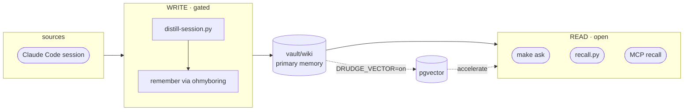

# ohmyboring

**English** · [한국어](README.ko.md) · [日本語](README.ja.md)

[](https://github.com/jazz1x/ohmyboring/actions/workflows/ci.yml)

[](LICENSE)


**Self-hosted personal memory RAG.** Your Claude Code sessions are distilled into a local, human-readable wiki and recalled on demand — *"how did I do this last time?"* **Zero cloud · 100% local.**

```bash
# Fastest — one-liner: clones to ~/oh-my-boring, builds, wires the Claude Code hooks.
sh -c "$(curl -fsSL https://raw.githubusercontent.com/jazz1x/ohmyboring/main/install.sh)"
```

Or step by step:

```bash
git clone https://github.com/jazz1x/ohmyboring.git ~/oh-my-boring
cd ~/oh-my-boring
make up
make ask Q="how did I fix the docker build cache problem?"
```

> Requires **Docker**, **Ollama** (or any OpenAI-compatible server), **Python 3**, **jq**, **curl**, **git**, and **make**.

---

## What it does

1. **Auto-accumulate** — when a session ends, it becomes a curated markdown note in `vault/wiki`. No manual upkeep.
2. **Markdown-first memory** — plain, human-readable, git-diffable notes. Recall reads them directly.
3. **Local-only** — embedding and synthesis run on your machine via Ollama. No external APIs or tokens.

Optional **pgvector** accelerator (`DRUDGE_VECTOR=on`) adds similarity search + GraphRAG when scale calls for it.

---

## Viewing your memory

The notes are just markdown, so **open the `vault/` folder as an [Obsidian](https://obsidian.md) vault** — graph view, backlinks, tags, and full-text search come for free. The compiled notes already carry Obsidian-safe `tags` and `[[wiki-NNNN]]` `relates_to` links, so the graph view draws your memory's connections directly (richest with `DRUDGE_VECTOR=on`, which projects the GraphRAG graph into those links). No custom UI to build. Obsidian's own `.obsidian/` workspace folder is gitignored, so your layout stays local and never leaks into git.

---

## Architecture



- **Read door** — fast, no LLM. `make ask`, `recall.py`, MCP `recall` read `vault/wiki` directly.
- **Write door** — gated. `distill-session.py` calls the local LLM and writes through ohmyboring's deterministic `remember` MCP tool.

---

## Configuration

Policy lives in **`boring.json`** (created from `boring.example.json` by `make up`):

```json
{
  "$schema": "https://raw.githubusercontent.com/jazz1x/ohmyboring/main/boring.schema.json",
  "schema_version": 1,
  "note_lang": "auto",
  "repos": [
    {"match": "your-company", "origin": "company", "name": "your-company"},
    {"match": "~/code", "origin": "personal", "name": "mine"}
  ],
  "agents": [
    {"id": "claude-code", "enabled": true, "format": "claude-json", "paths": ["~/.claude/projects"]}
  ]
}
```

| Key | Purpose |
|---|---|
| `note_lang` | `auto` · `ko` · `en` |
| `repos[]` | path/remote rules → `origin=personal/company/mirror/community` |
| `agents[]` | ingest sources for vector mode |

Secrets and runtime switches live in **`.env`**:

| Variable | Purpose |
|---|---|
| `DRUDGE_VECTOR` | `on` enables pgvector (optional) |
| `DRUDGE_LLM_BASE_URL` | OpenAI-compatible endpoint. Docker default `http://host.docker.internal:11434/v1`; use `http://localhost:11434/v1` for Native mode |
| `DRUDGE_LLM_MODEL` / `DRUDGE_EMBED_MODEL` | default `gemma4:12b` / `bge-m3` |
| `SLACK_APP_TOKEN` / `SLACK_BOT_TOKEN` | optional Slack assistant |

> **Swapping the embedding model changes the vector dimension.** The synthesis model (`DRUDGE_LLM_MODEL`) is free to swap, but a new `DRUDGE_EMBED_MODEL` emits vectors of a different size, so you must update `embed_dim` in `boring.json` to match **and** run `make reset` — otherwise upserts fail against the old-shaped vectors. Common dims: `bge-m3` = 1024 · OpenAI `text-embedding-3-small` = 1536 · `nomic-embed-text` = 768.

---

## Commands

| Command | Description |
|---|---|
| `make up` | set up + start the ohmyboring engine (hermes-agent joins only if its image exists) |
| `make ollama` | ensure Ollama is running (start in background if needed) |
| `make ask Q="..."` | one-shot recall + synthesis |
| `make sync` | deterministic re-ingest of the vault |
| `make remember M="text"` | write a one-line note |
| `make collect [N=1]` | lazy backfill of past sessions |
| `make hermes-build` | clone/build the optional hermes-agent image |
| `make smoke` | end-to-end smoke test |
| `make logs` | engine logs |
| `make guard` | fmt + clippy + test + Python py-compile |
| `make down` | stop containers |

---

## Agent adapters

`agents/` contains the **host-side adapters** that connect external agents to the ohmyboring engine. Every adapter talks to ohmyboring through the same MCP/HTTP surface; none are required.

The old `hooks/` path still works as a set of backward-compatible symlinks, so existing Claude Code `settings.json` entries and cron jobs don't break.

| Adapter | Path | Consumer | Entry point | What it does |
|---|---|---|---|---|
| Claude Code | `agents/claude-code/distill-session.py` | `SessionEnd` / `Stop` hook | Distills a session and calls `remember` |
| Claude Code | `agents/claude-code/recall.py` | `UserPromptSubmit` hook | Pulls relevant snippets and injects them as prompt context |
| Cursor | `agents/cursor/README.md` | MCP only | `~/.cursor/mcp.json` | Exposes `ohmyboring` as an MCP server |
| Codex | `agents/codex/README.md` | MCP only | `~/.codex/mcp.json` | Exposes `ohmyboring` as an MCP server |
| hermes-agent | `agents/hermes/ingest-worker.py` | `hermes cron --script` | Serial backfill, one session per cron tick |
| scheduler | `agents/schedulers/collect-sessions.py` | cron / launchd / manual | Lazy backfill of older sessions |
| shared | `agents/shared/boring_config.py` | imported by adapters | `boring.json` policy loader |
| shared | `agents/shared/agent_wiring.py` | `install.sh` | Idempotently configures hooks/MCP for enabled agents |

### Token budget

Automatic retrieval can explode an agent's context window, so the retrieval surface is budget-aware:

- MCP `recall` accepts `max_tokens` and `max_results`.
- HTTP `/search` accepts `max_tokens` and `max_results`.
- `recall.py` caps its prompt-injection context via `RECALL_MAX_TOKENS` / `RECALL_MAX_RESULTS`.
- `ask`/`brief` synthesis keeps retrieved context under a fixed character ceiling.

### Other agents

Any MCP-capable agent can use ohmyboring. The repo ships a standard **`.mcp.json`** (root key `mcpServers`) that Claude Code, Cursor, Windsurf, and Claude Desktop read when it is placed in a project directory or user config path:

```json
{ "mcpServers": { "ohmyboring": { "type": "http", "url": "http://localhost:7700/mcp" } } }
```

`install.sh` automatically wires:
- Claude Code hooks in `~/.claude/settings.json`
- Cursor's `~/.cursor/mcp.json` and Codex's `~/.codex/mcp.json` when those agents are enabled in `boring.json`

For other agents, copy the root `.mcp.json` to the appropriate location (e.g. `~/.claude/mcp.json` for Claude Desktop) or use the agent's CLI to add the HTTP MCP server.

(VS Code Copilot uses `.vscode/mcp.json` with the root key `servers`. CLI alt: `claude mcp add --transport http --scope project ohmyboring http://localhost:7700/mcp`. Compose siblings reach it at `http://boring-drudge:7700/mcp`.)

Available tools (11): `recall`, `neighbors`, `claims` (retrieval) · `ask`, `brief` (generative — run the LLM) · `corpus_status`, `config_get` (introspection) · `remember`, `forget`, `classify_repo`, `sync` (write / maintain).

In the default wiki-first mode (`DRUDGE_VECTOR=off`), four tools require the pgvector backend and return JSON-RPC `-32603` until you set `DRUDGE_VECTOR=on`: `neighbors`, `claims`, `corpus_status`, `brief`. The other seven (`recall`, `ask`, `remember`, `forget`, `sync`, `config_get`, `classify_repo`) work against `vault/wiki` directly.

- `neighbors` *(requires `DRUDGE_VECTOR=on`)* — graph traversal from a topic: embeds the query, takes the single closest note, then returns its 1-hop labels (`{hit, graph_neighbors, semantic_neighbors}` JSON). `hit` is the matched note's path; `graph_neighbors` are its project/topic labels and `semantic_neighbors` its shared tool/concept labels — flat strings, not note paths.
- `claims` *(requires `DRUDGE_VECTOR=on`)* — top-k current (non-superseded) `{subject, predicate, value}` decisions near a query.
- `corpus_status` *(requires `DRUDGE_VECTOR=on`)* — KB health snapshot (file/chunk counts, by origin/kind/project, contamination, graph/semantic nodes+edges).
- `ask` / `brief` — the only LLM-running tools: `ask` answers a question with cited sources (works in wiki-first mode); `brief` *(requires `DRUDGE_VECTOR=on`)* is a recency-first work briefing.
- `forget` — delete a note by wiki id or exact title. Removes the wiki file and, in vector mode, also purges embeddings, graph edges, and claims.

Structured tools (`neighbors`, `claims`, `corpus_status`, `config_get`, `ask`, `brief`) return native `structuredContent` (JSON) alongside the text block; prose/ack tools (`recall`, `remember`, `forget`, `sync`, `classify_repo`) return text.

Example MCP call (raw JSON-RPC over HTTP):

```bash
curl -s -X POST http://localhost:7700/mcp \
  -H 'content-type: application/json' \
  -d '{
    "jsonrpc": "2.0",
    "id": 1,
    "method": "tools/call",
    "params": {
      "name": "recall",
      "arguments": {
        "query": "docker build cache fix",
        "max_tokens": 1500,
        "max_results": 3
      }
    }
  }' | jq .
```

### Optional: hermes-agent

[hermes-agent](https://hermes-agent.org) is a third-party autonomous supervisor. It can drive Slack, orchestration, and cron-based backfill through ohmyboring's MCP backend. Build the image separately; `make up` picks it up automatically if it exists.

It is configured per the hermes-agent project's **own docs** (out of scope here) — point its `~/.hermes/config.yaml` at ohmyboring's MCP (`http://boring-drudge:7700/mcp`). What ohmyboring ships wires it up as the Slack assistant; to use it for anything beyond that, build or modify the image yourself.

---

## Deployment

| Mode | How |
|---|---|
| **Docker** (default) | `make up` |
| **Native** | `cd drudge && DRUDGE_VAULT_DIR="$PWD/../vault" DRUDGE_HTTP_ADDR=127.0.0.1:7700 cargo run --release -- serve` |

> Native `serve` needs `DRUDGE_VAULT_DIR` — without it `remember` fails with `DRUDGE_VAULT_DIR not set`. It also binds `0.0.0.0:7700` by default; set `DRUDGE_HTTP_ADDR=127.0.0.1:7700` to keep it loopback-only.

---

## Development · guardrails

- SSOT docs: `drudge/{PHILOSOPHY,RUST-STYLE,ENFORCEMENT}.md`
- `make guard` = `rustfmt --check` + `clippy -D warnings` + `cargo test`
- CI: `rust-gate` · `gitleaks` · `cargo-deny` · `trivy`
- `unsafe_code = "forbid"`

---

## Troubleshooting

| Symptom | Fix |
|---|---|
| `make up` fails | Check Ollama: `curl -sf http://127.0.0.1:11434/api/tags` |
| Port conflict | `lsof -i :7700 -i :5432 -i :11434` |
| Second `make up` / re-clone fails | Run `make down` first — the containers use fixed names and bind `127.0.0.1:7700` / `:5432`, so a second stack collides with the running one |
| Agent not starting | `OMB_CORE_ONLY=1 make up` runs core-only; hermes image must be built separately |
| Linux: container can't reach host Ollama | On Linux, Ollama binds `127.0.0.1` by default, so the container hits a closed port even though `host.docker.internal` resolves. Bind Ollama to all interfaces (`OLLAMA_HOST=0.0.0.0:11434`, then restart it) and/or allow the docker bridge in the host firewall |
| Healthy? / did the last distill land? | `make doctor` — quick health + last-ingest check |

---

## Keeping Ollama alive

`make up` starts Ollama if it isn't running, but if it stops later, the next session ingest will fail.

- Quick check/start: `make ollama`
- Keep it alive across reboots (macOS):
  ```bash
  brew services start ollama
  ```
- Or run it in a persistent terminal: `ollama serve`

## Periodic sync

The engine schedules a deterministic sync every 4 hours, but if you edit `vault/wiki/` by hand or want fresher vector/graph data, run:

```bash
make sync
```

For automatic periodic sync, add a cron job:

```bash
# Every hour
0 * * * * cd ~/oh-my-boring && make sync >/tmp/omb-sync.log 2>&1
```

---

## Directory

```text
oh-my-boring/
├─ drudge/                  # Rust engine
├─ agents/                  # host-side agent adapters
│  ├─ claude-code/          # Claude Code hooks
│  ├─ hermes/               # hermes-agent cron
│  ├─ schedulers/           # cron/launchd backfill
│  └─ shared/               # policy/config library
├─ hooks/                   # backward-compatible symlinks → agents/
├─ scripts/                 # guard.sh · smoke.sh
├─ vault/                   # raw → wiki memory
├─ data/                    # Postgres persistence (gitignored)
├─ docker-compose.yml
├─ start.sh
├─ boring.json              # policy (created by make up)
└─ Makefile
```

> **Note on vault/wiki IDs:** `wiki-0000.md` is the tracked sample note (shipped with the repo). Personal notes start at `wiki-0001.md` and are gitignored, so your private content never leaks into git.
>
> **Platform note:** Tested on macOS and Linux. Windows is not officially supported yet because `hooks/` uses symlinks for backward compatibility.
