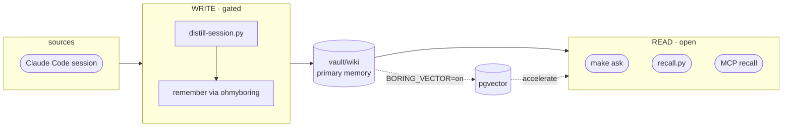

# ohmyboring

**English** · [한국어](README.ko.md) · [日本語](README.ja.md)

[](https://github.com/jazz1x/ohmyboring/actions/workflows/ci.yml)

[](LICENSE)


**Self-hosted personal memory RAG.** Your Claude Code / Kimi Code sessions and eligible Codex transcripts are distilled into a local, human-readable wiki and recalled on demand — *"how did I do this last time?"* **Zero cloud · 100% local.**

```bash
# Fastest — one-liner: clones to ~/oh-my-boring, builds, wires hooks/MCP/workers.
sh -c "$(curl -fsSL https://raw.githubusercontent.com/jazz1x/ohmyboring/main/install.sh)"
```

Or step by step:

```bash
git clone https://github.com/jazz1x/ohmyboring.git ~/oh-my-boring
cd ~/oh-my-boring
make up
make doctor         # verify stack, hooks, Codex worker/queue, and latest ingest
make readiness      # strict gate before relying on morning briefs
make collect N=20   # seed the vault from your past Claude Code sessions (fresh clone starts empty)
make ask Q="how did I fix the docker build cache problem?"
```

> A fresh clone has an **empty vault**, so day-1 `make ask` finds nothing. `make collect` backfills your Claude history; after that, Claude/Kimi sessions auto-accumulate and Codex is picked up by its worker when eligible (see [Feeding it](#feeding-it-ingestion)).

> Requires **Docker**, **Ollama** or another OpenAI-compatible local server such as **LM Studio**, **Python 3**, **jq**, **curl**, **git**, and **make**.

---

## What it does

1. **Auto-accumulate** — when a session ends, or when the Codex worker finds an eligible transcript, it becomes a curated markdown note in `vault/wiki`. No manual upkeep.
2. **Markdown-first memory** — plain, human-readable, git-diffable notes. Recall reads them directly.
3. **Local-only** — embedding and synthesis run on your machine via Ollama, LM Studio, or another OpenAI-compatible endpoint. No external APIs or tokens.

Optional **pgvector** accelerator (`BORING_VECTOR=on`) adds similarity search + GraphRAG when scale calls for it.

---

## Feeding it (ingestion)

Memory gets in four ways — after setup you rarely touch the automatic paths:

| How | Command | When |
| --- | --- | --- |
| **Automatic, on session end** | SessionEnd hook (wired by `install.sh`) | every Claude Code / Kimi session — `hooks/distill-session.py` distills the transcript and `remember`s it. The paired `UserPromptSubmit` hook (`recall.py`) auto-injects relevant past memory into new prompts. |
| **Automatic, Codex worker** | host launchd/cron worker (wired by `install.sh`) | Codex has no SessionEnd hook. A host worker scans `~/.codex/sessions/**/*.jsonl` every 20 minutes, skips Codex Desktop `rollout-*` copies by default, and stores eligible transcripts through the same `remember` path. If `hermes-agent` is enabled, it also gets a `codex-memory-ingest-worker`. Check both with `make doctor`. |
| **Backfill past sessions** | `make collect [N=20]` | once after install, to seed an otherwise-empty vault from your `~/.claude/projects` history. Newest-first, idempotent (a per-session marker skips already-distilled ones), `N` per run so it never hogs CPU. |
| **Right now, mid-session** | `make distill-now` · `make remember M="…"` | capture something immediately *without* ending the session. `distill-now` re-distills the **current** transcript on demand and leaves no marker, so the normal end-of-session capture still runs (you may get an early note plus the final one). `remember` saves an explicit note you write yourself. |

### Wiring the hooks manually

`install.sh` does this for you. To redo it (or if you ran with `BORING_WIRE=0`):

```bash
python3 agents/shared/agent_wiring.py --install \
  --boring-home ~/oh-my-boring --server-name ohmyboring \
  --server-url http://localhost:7700/mcp
```

This installs Claude/Kimi hooks, Cursor/Codex MCP entries, the Codex host worker, and Hermes cron workers when `hermes-agent` is enabled. Or edit `~/.claude/settings.json` by hand for Claude only: a `SessionEnd` hook running `python3 ~/oh-my-boring/hooks/distill-session.py`, plus a `UserPromptSubmit` hook running `recall.py`.

---

## Viewing your memory

The notes are just markdown, so **open the `vault/` folder as an [Obsidian](https://obsidian.md) vault** — graph view, backlinks, tags, and full-text search come for free. The compiled notes already carry Obsidian-safe `tags` and `[[wiki-NNNN]]` `relates_to` links, so the graph view draws your memory's connections directly (richest with `BORING_VECTOR=on`, which projects the GraphRAG graph into those links). No custom UI to build. Obsidian's own `.obsidian/` workspace folder is gitignored, so your layout stays local and never leaks into git.

---

## Architecture



- **Read door** — fast, no LLM. `make ask`, `recall.py`, MCP `recall` read `vault/wiki` directly.
- **Write door** — gated. `distill-session.py` calls the local LLM and writes through ohmyboring's deterministic `remember` MCP tool.

---

## Configuration

Policy lives in **`boring.json`** (created from `boring.example.json` by `make up`):

```json
{
  "$schema": "https://raw.githubusercontent.com/jazz1x/ohmyboring/main/boring.schema.json",
  "schema_version": 2,
  "note_lang": "auto",
  "llm": {
    "provider": "ollama",
    "base_url": "http://host.docker.internal:11434/v1",
    "model": "gemma4:12b",
    "embed_model": "bge-m3",
    "embed_dim": 1024,
    "api_key_env": "BORING_LLM_API_KEY",
    "bootstrap": "auto"
  },
  "repos": [
    {"match": "your-company", "origin": "company", "name": "your-company"},
    {"match": "~/code", "origin": "personal", "name": "mine"}
  ],
  "agents": [
    {"id": "claude-code", "enabled": true, "format": "claude-json", "paths": ["~/.claude/projects"]}
  ]
}
```

| Key | Purpose |
|---|---|
| `note_lang` | `auto` · `ko` · `en` |
| `llm.provider` | `ollama` (pulls models) · `lmstudio` (load in-app, no pull) · `openai-compatible` (vLLM / llama.cpp / remote) |
| `llm.base_url` / `llm.model` | OpenAI-compatible `/v1` endpoint + synthesis model |
| `llm.embed_model` / `llm.embed_dim` | embedding model + its vector dimension (kernel's only model) |
| `llm.bootstrap` | `auto` = bootstrap may start/pull · `manual` = health-check only (you own the server) |
| `repos[]` | path/remote rules → `origin=personal/company/mirror/community` |
| `agents[]` | ingest sources for vector mode |

**Switching LLM backend** is one config block. `make up` dispatches to `scripts/llm-providers/<provider>.sh` for the right bootstrap: Ollama can start/pull models; LM Studio only health-checks the server and expects models to be loaded in the app.

### LM Studio backend

LM Studio works through its OpenAI-compatible `/v1` server. Use `host.docker.internal` in `boring.json` because the Docker container calls back to the host; use `localhost` only for host-side checks and benchmarks.

```json
{
  "llm": {
    "provider": "lmstudio",
    "base_url": "http://host.docker.internal:1234/v1",
    "model": "<exact chat model id from /v1/models>",
    "embed_model": "<exact embedding model id from /v1/models>",
    "embed_dim": 768,
    "api_key_env": "BORING_LLM_API_KEY",
    "bootstrap": "manual"
  }
}
```

Start the LM Studio local server, load one chat model and one embedding model, then verify before `make up`:

```bash
curl -s http://localhost:1234/v1/models | jq -r '.data[].id'
make verify-llm
make up
make doctor
make readiness
```

The model ids must match what LM Studio reports. If the embedding model is not `bge-m3`, update `llm.embed_dim` to the model's dimension and run `make reset` before relying on vector mode. See the [LM Studio runbook](docs/runbooks/lmstudio.md) for the full checklist.

`.env` is now only secrets + runtime overrides:

| Variable | Purpose |
|---|---|
| `BORING_VECTOR` | `on` enables pgvector (optional) |
| `BORING_LLM_BASE_URL` / `BORING_LLM_MODEL` | optional runtime override of `llm.base_url` / `llm.model`. Running the `drudge` binary directly on the host? Set `BORING_LLM_BASE_URL=http://localhost:11434/v1` |
| `BORING_LLM_API_KEY` | API key when `llm.api_key_env` points here (auth providers) |
| `BORING_DISTILL_RESOLUTION` | distillation detail contract: `compact`, `standard`, `evidence` (default), or `forensic`; verifier failures repair once, then block `remember` |
| `BORING_EVENT_LOG` | local NDJSON workflow events; defaults to `~/.cache/oh-my-boring/events.ndjson` |
| `BORING_EVENT_RECENT_HOURS` | recent event window used by `make readiness`; defaults to `24` |
| `SLACK_APP_TOKEN` / `SLACK_BOT_TOKEN` | optional Slack assistant |

> **Swapping the embedding model changes the vector dimension.** The synthesis model (`llm.model`) is free to swap, but a new `llm.embed_model` emits vectors of a different size, so you must update `llm.embed_dim` to match **and** run `make reset` — otherwise upserts fail against the old-shaped vectors. Common dims: `bge-m3` = 1024 · OpenAI `text-embedding-3-small` = 1536 · `nomic-embed-text` = 768.

### Local model selection

ohmyboring runs two local models: a **synthesis model** for distillation/ask, and an **embedding model** for vector search. The synthesis model can be changed freely; the embedding model can too, but it requires updating `llm.embed_dim` and running `make reset`.

Below is a same-scale pairing guide by MacBook RAM. If a tier has no viable model in one family, the cell is left empty.

| MacBook RAM | gemma4 (Google) | qwen3 (Alibaba) | Notes |
|------------:|-----------------|-----------------|-------|
| 8 GB | — | `qwen3:4b` | Gemma4 has no practical 8 GB option. |
| 16 GB | `gemma4:12b` | `qwen3:14b` | Closest same-scale dense pair (12B vs 14B). |
| 24 GB | `gemma4:26b-a4b` | `qwen3:30b-a3b` | Same-scale MoE pair. |
| 32 GB | `gemma4:31b` | `qwen3:32b` | Dense flagship pair. |
| 48 GB | `gemma4:31b` | `qwen3:32b` | Same models, with headroom for context/apps. |
| 64 GB+ | — | — | No practical new local pair; `qwen3:235b-a22b` needs ~142 GB disk. |

Benchmark commands:

```bash
# LLM distillation benchmark by RAM tier
make bench-llm                  # default 16 GB tier
make bench-llm-tier TIER=32gb

# Embedding model benchmark (dim / latency / sanity)
make bench-embed
```

Measured on a MacBook Pro (M5 Pro, 48 GB RAM) with local Ollama. The 16 GB tier pair (`gemma4:12b` vs `qwen3:14b`) hits 100% valid JSON, target-language title, 2+ body sections, and clean body in Korean and English; in Japanese `qwen3:14b` occasionally reverts to Korean titles (67% Japanese-title rate on 3 samples) while `gemma4:12b` and `qwen3:8b` stay at 100%. Average latency: `gemma4:12b` ~13–16 s, `qwen3:14b` ~12–18 s, `qwen3:8b` ~6–8 s. `bge-m3` embedding averaged **0.105 s** per text and passed the cosine sanity check.

See [`docs/reports/llm-pair-matrix.md`](docs/reports/llm-pair-matrix.md) for per-language tables, tag sizes, methodology, and LM Studio notes.

### Naming layers

One name per layer — the `ohmyzsh` ↔ `~/.oh-my-zsh` pattern. Only the layer changes, not the thing:

| Layer | Name | Appears in |
|---|---|---|
| Brand / repo / MCP server | `ohmyboring` | repo URL, `.mcp.json`, `--server-name` |
| Install dir / compose project | `~/oh-my-boring` | clone path, `BORING_HOME`, compose project name |
| Engine package / binary | `drudge` | `Cargo.toml`, source, the `drudge` CLI |
| Containers | `boring-*` | `boring-drudge` · `boring-postgres` · `boring-agent` |
| Env-var prefix | `BORING_*` | `BORING_VECTOR` · `BORING_URL` · `BORING_LLM_*` · `BORING_VAULT_DIR` · `BORING_HOME` |

---

## Commands

| Command | Description |
|---|---|
| `make up` | set up + start the ohmyboring engine (hermes-agent joins only if its image exists) |
| `make ollama` | ensure Ollama is running (start in background if needed) |
| `make verify-llm` | verify provider reachability, loaded model ids, and embedding dimension |
| `make doctor` | diagnose stack, hooks, latest ingest, and Codex worker/queue status |
| `make readiness` | strict pre-briefing gate; fails on any doctor finding |
| `make ask Q="..."` | one-shot recall + synthesis |
| `make sync` | deterministic re-ingest of the vault |
| `make remember M="text"` | write a one-line note |
| `make collect [N=1]` | lazy backfill of past Claude Code sessions |
| `make collect-kimi [N=1]` | lazy backfill of past Kimi Code sessions |
| `make hermes-build` | clone/build the optional hermes-agent image |
| `make smoke` | end-to-end smoke test |
| `make logs` | engine logs |
| `make guard` | fmt + clippy + test + Python py-compile |
| `make quality` | release acceptance drift gate |
| `make down` | stop containers |

---

## Usage examples

### Backfill all supported agents

```bash
# Claude Code (default make collect)
make collect N=20

# Kimi Code
make collect-kimi N=20

# GitHub Codex (normally handled by the Hermes worker)
make doctor
COLLECT_LIMIT=20 python3 agents/codex/collect-sessions.py
```

### Daily/weekly consumption

```bash
# Structured context card for the start of a session (works with BORING_VECTOR=off)
curl -s -X POST http://localhost:7700/context \
  -H 'content-type: application/json' \
  -d '{"project":"omb","max_items":5}' | jq .

# Weekly brief (requires BORING_VECTOR=on)
curl -s -X POST http://localhost:7700/weekly \
  -H 'content-type: application/json' \
  -d '{"project":"omb"}' | jq .

# Preview the exact Slack-bound morning brief text
BORING_URL=http://127.0.0.1:7700 python3 agents/hermes/briefing.py

# Stalled register — things that have not moved in 7+ days (requires BORING_VECTOR=on)
curl -s -X POST http://localhost:7700/stalled \
  -H 'content-type: application/json' \
  -d '{"project":"omb","older_than_days":7}' | jq .
```

Hermes cron sends briefing script stdout as Slack `mrkdwn` text. `make eval` fixture notes are searchable during the gate but are pruned afterward and excluded from recency/claim briefing surfaces so test corpus entries do not appear in daily or weekly digests.

### PII / sensitive-data gate

Policy lives in `vault/rules/pii.yaml` and an optional gitignored `vault/rules/pii.local.yaml`:

```yaml
# vault/rules/pii.local.yaml — company-specific shapes, never commit
version: "1.0"
policy:
  default_action: flag
  exemption_marker: "<!-- pii-allow:"
rules:
  - name: internal-ticket
    regex: '\bPROJ-\d{4,}\b'
    action: flag
    severity: warning
    reason: "Internal ticket id"
  - name: staging-password
    regex: '\bstaging[_-]?pass\s*=\s*[^\s]+'
    action: redact
    replacement: "[STAGING-PASS]"
    severity: critical
    reason: "Staging credential"
```

A `block` rule rejects the note at `remember` time; a `redact` rule masks matches before saving; a `flag` rule saves the note and adds a `pii-flag` tag. To let a flagged shape through on one line, add the exemption marker on that line:

```markdown
The Jira ticket PROJ-1234 <!-- pii-allow: internal-ticket --> is public.
```

### MCP tool call (raw JSON-RPC)

```bash
curl -s -X POST http://localhost:7700/mcp \
  -H 'content-type: application/json' \
  -d '{
    "jsonrpc": "2.0",
    "id": 1,
    "method": "tools/call",
    "params": {
      "name": "recall",
      "arguments": {
        "query": "docker build cache fix",
        "max_tokens": 1500,
        "max_results": 3,
        "project": "omb",
        "since_hours": 168
      }
    }
  }' | jq .
```

---

## Agent adapters

`agents/` contains the **host-side adapters** that connect external agents to the ohmyboring engine. Every adapter talks to ohmyboring through the same MCP/HTTP surface; none are required.

The old `hooks/` path still works as a set of backward-compatible symlinks, so existing Claude Code `settings.json` entries and cron jobs don't break.

| Adapter | Path | Consumer | Entry point | What it does |
|---|---|---|---|---|
| Claude Code | `agents/claude-code/distill-session.py` | `SessionEnd` / `Stop` hook | Distills a session and calls `remember` |
| Claude Code | `agents/claude-code/session-start-recall.py` | `SessionStart` hook | Loads structured context (`/context`) before the first turn |
| Claude Code | `agents/claude-code/recall.py` | `UserPromptSubmit` hook | Pulls relevant snippets and injects them as prompt context |
| Kimi Code | `agents/kimi/distill-session.py` | `SessionEnd` hook | Distills a Kimi session and calls `remember` |
| Kimi Code | `agents/kimi/recall.py` | `UserPromptSubmit` hook | Pulls relevant snippets and injects them as prompt context |
| Cursor | `agents/cursor/README.md` | MCP only | `~/.cursor/mcp.json` | Exposes `ohmyboring` as an MCP server |
| Codex | `agents/codex/README.md` | MCP + host worker backfill | `~/.codex/mcp.json` / launchd or cron / `collect-sessions.py` | Exposes `ohmyboring` as an MCP server and backfills eligible Codex sessions; rollout copies are skipped |
| hermes-agent | `agents/hermes/` | `hermes cron --script` + MCP | Config-driven cron (`weekly-briefing`, `briefing`) + serial backfill workers (`ingest-worker.py`, Codex collector) |
| scheduler | `agents/schedulers/collect-sessions.py` | cron / launchd / manual | Lazy backfill of older Claude Code sessions |
| scheduler | `agents/schedulers/collect-kimi-sessions.py` | cron / launchd / manual | Lazy backfill of older Kimi Code sessions |
| shared | `agents/shared/boring_config.py` | imported by adapters | `boring.json` policy loader |
| shared | `agents/shared/agent_wiring.py` | `install.sh` | Idempotently configures hooks/MCP for enabled agents |

### Consumption endpoints

Memory can be reached through HTTP endpoints or the MCP server (`http://localhost:7700/mcp`):

| Endpoint / MCP tool | Purpose | Vector backend |
|---|---|---|
| `POST /context` / `context` | Structured context card: decisions, risks, facts, glossary, next_actions | not required |
| `POST /next_actions` / `next_actions` | Next-action register: explicit next steps + active blockers | required |
| `POST /stalled` / `stalled` | Stalled register: old next steps and blockers | required |
| `POST /status` / `project_status` | 30-day project status (Done/Next/Blocked/Decisions/Risks) | required |
| `POST /weekly` / `weekly_brief` | Last 7 days across projects | required |
| `POST /decisions` / `decisions` | Decision claims for a project | required |
| `POST /risks` / `risks` | Risk/assumption/blocked claims for a project | required |
| `POST /ask` / `ask` | Direct question answered from memory | not required |
| `POST /search` / `recall` | Raw memory excerpts | not required; semantic search uses vector when enabled |
| `/remember` / `remember` | Store a curated note | — |

### Token budget

Automatic retrieval can explode an agent's context window, so the retrieval surface is budget-aware:

- MCP `recall` and HTTP `/search` accept `max_tokens`, `max_results`, `project`, and `since_hours`.
- MCP `ask` and HTTP `/ask` accept `project` and `since_hours` to narrow retrieval.
- `/context` caps each section at `max_items` (default 5) and needs no vector search.
- `recall.py` caps its prompt-injection context via `RECALL_MAX_TOKENS` / `RECALL_MAX_RESULTS`.
- `ask`/`brief` synthesis keeps retrieved context under a fixed character ceiling.

### Other agents

Any MCP-capable agent can use ohmyboring. The repo ships a standard **`.mcp.json`** (root key `mcpServers`) that Claude Code, Cursor, Windsurf, and Claude Desktop read when it is placed in a project directory or user config path:

```json
{ "mcpServers": { "ohmyboring": { "type": "http", "url": "http://localhost:7700/mcp" } } }
```

`install.sh` automatically wires:
- Claude Code hooks in `~/.claude/settings.json`
- Kimi Code hooks in `~/.kimi-code/config.toml`
- Cursor's `~/.cursor/mcp.json` and Codex's `~/.codex/mcp.json` when those agents are enabled in `boring.json`

For other agents, copy the root `.mcp.json` to the appropriate location (e.g. `~/.claude/mcp.json` for Claude Desktop or `~/.kimi-code/mcp.json` for Kimi Code MCP) or use the agent's CLI to add the HTTP MCP server.

(VS Code Copilot uses `.vscode/mcp.json` with the root key `servers`. CLI alt: `claude mcp add --transport http --scope project ohmyboring http://localhost:7700/mcp`. Compose siblings reach it at `http://boring-drudge:7700/mcp`.)

Available tools (18): `recall`, `neighbors`, `claims` (retrieval) · `ask`, `brief`, `weekly_brief`, `project_status`, `decisions`, `risks`, `next_actions`, `stalled` (generative — run the LLM) · `context`, `corpus_status`, `config_get` (structured / introspection) · `remember`, `forget`, `classify_repo`, `sync` (write / maintain).

In the default wiki-first mode (`BORING_VECTOR=off`), tools that rely on recency/vector ordering or the graph return JSON-RPC `-32603` until you set `BORING_VECTOR=on`: `neighbors`, `claims`, `corpus_status`, `brief`, `weekly_brief`, `project_status`, `decisions`, `risks`, `next_actions`, `stalled`. `recall` and `ask` read `vault/wiki` directly; `context` is callable but returns an empty claim card without the store; `remember`, `forget`, `sync`, `config_get`, and `classify_repo` do not require vector mode.

- `next_actions` *(requires `BORING_VECTOR=on`)* — next-action register: recent `next` claims and active `blocked` claims synthesized into a short todo/blocker list. Optionally filter by project.
- `stalled` *(requires `BORING_VECTOR=on`)* — stalled register: `next` and `blocked` claims older than `older_than_days` (default 7).
- `decisions` *(requires `BORING_VECTOR=on`)* — decision register: recent `decision` claims for a project.
- `risks` *(requires `BORING_VECTOR=on`)* — risk register: recent `risk`, `assumption`, and `blocked` claims for a project.
- `neighbors` *(requires `BORING_VECTOR=on`)* — graph traversal from a topic: embeds the query, takes the single closest note, then returns its 1-hop labels (`{hit, graph_neighbors, semantic_neighbors}` JSON). `hit` is the matched note's path; `graph_neighbors` are its project/topic labels and `semantic_neighbors` its shared tool/concept labels — flat strings, not note paths.
- `claims` *(requires `BORING_VECTOR=on`)* — top-k current (non-superseded) `{subject, predicate, value}` decisions near a query.
- `corpus_status` *(requires `BORING_VECTOR=on`)* — KB health snapshot (file/chunk counts, by origin/kind/project, contamination, graph/semantic nodes+edges).
- `ask` / `brief` / `weekly_brief` / `project_status` / `decisions` / `risks` / `next_actions` / `stalled` — LLM-running tools: `ask` answers a question with cited sources (works in wiki-first mode); the rest are recency/claim registers that require `BORING_VECTOR=on`.
- `forget` — delete a note by wiki id or exact title. Removes the wiki file and, in vector mode, also purges embeddings, graph edges, and claims.

Structured tools (`neighbors`, `claims`, `corpus_status`, `config_get`, `ask`, `brief`, `weekly_brief`, `project_status`, `decisions`, `risks`, `next_actions`, `stalled`, `context`) return native `structuredContent` (JSON) alongside the text block; prose/ack tools (`recall`, `remember`, `forget`, `sync`, `classify_repo`) return text.

Example MCP call (raw JSON-RPC over HTTP):

```bash
curl -s -X POST http://localhost:7700/mcp \
  -H 'content-type: application/json' \
  -d '{
    "jsonrpc": "2.0",
    "id": 1,
    "method": "tools/call",
    "params": {
      "name": "recall",
      "arguments": {
        "query": "docker build cache fix",
        "max_tokens": 1500,
        "max_results": 3,
        "project": "omb",
        "since_hours": 168
      }
    }
  }' | jq .
```

### Optional: hermes-agent

[hermes-agent](https://hermes-agent.org) is a third-party autonomous supervisor. It can drive Slack, orchestration, and cron-based backfill through ohmyboring's MCP backend. Build the image separately; `make up` picks it up automatically if it exists.

When hermes-agent is enabled in `boring.json`, `make up` wires it automatically:

- Adds `mcp_servers.ohmyboring` to `~/.hermes/config.yaml`
- Installs the canonical `~/.hermes/scripts/briefing.py` (uses `BORING_URL`, with `DRUDGE_URL` as a legacy fallback)
- Validates the connection in `make smoke`

Enable it in `boring.json`:

```json
{
  "id": "hermes-agent",
  "enabled": true,
  "adapter": "cron"
}
```

If you customized `~/.hermes/config.yaml` or `~/.hermes/scripts/briefing.py`, back them up first; `make up` preserves a `.omb-bak` copy before overwriting.

---

## Deployment

| Mode | How |
|---|---|
| **Docker** (default) | `make up` |
| **Native** | `cd drudge && BORING_VAULT_DIR="$PWD/../vault" BORING_HTTP_ADDR=127.0.0.1:7700 cargo run --release -- serve` |

> Native `serve` needs `BORING_VAULT_DIR` — without it `remember` fails with `BORING_VAULT_DIR not set`. It also binds `0.0.0.0:7700` by default; set `BORING_HTTP_ADDR=127.0.0.1:7700` to keep it loopback-only.

---

## Development · guardrails

- SSOT docs: `drudge/{PHILOSOPHY,RUST-STYLE,ENFORCEMENT}.md`
- `make guard` = `rustfmt --check` + `clippy -D warnings` + `cargo test`
- `make quality` = release acceptance drift gate for MCP tools, vector-mode docs, and removed dangerous surfaces
- CI: `rust-gate` · `quality-gate` · `gitleaks` · `cargo-deny` · `trivy`
- `unsafe_code = "forbid"`

---

## Troubleshooting

| Symptom | Fix |
|---|---|
| `make up` fails | Check Ollama: `curl -sf http://127.0.0.1:11434/api/tags` |
| LM Studio selected but `make up` fails | Start LM Studio's local server, load the exact chat and embedding model ids from `boring.json`, then run `make verify-llm` |
| Port conflict | `lsof -i :7700 -i :5432 -i :11434` |
| Second `make up` / re-clone fails | Run `make down` first — the containers use fixed names and bind `127.0.0.1:7700` / `:5432`, so a second stack collides with the running one |
| Agent not starting | `BORING_CORE_ONLY=1 make up` runs core-only; hermes image must be built separately |
| Linux: container can't reach host Ollama | On Linux, Ollama binds `127.0.0.1` by default, so the container hits a closed port even though `host.docker.internal` resolves. Bind Ollama to all interfaces (`OLLAMA_HOST=0.0.0.0:11434`, then restart it) and/or allow the docker bridge in the host firewall |
| `embedding dim mismatch` errors | Your `llm.embed_model` output size ≠ `llm.embed_dim` in `boring.json`. Update `embed_dim` to match the new model and run `make reset` |
| Healthy? / did the last distill land? | `make doctor` — quick health + last-ingest and Codex worker/queue check |
| Can I rely on tomorrow morning's briefing? | `make readiness` — strict gate; every hook/model/container/ingest finding must pass |

---

## Keeping Ollama alive

`make up` starts Ollama if it isn't running, but if it stops later, the next session ingest will fail.

- Quick check/start: `make ollama`
- Keep it alive across reboots (macOS):
  ```bash
  brew services start ollama
  ```
- Or run it in a persistent terminal: `ollama serve`

## Periodic sync

The engine schedules a deterministic sync every 4 hours, but if you edit `vault/wiki/` by hand or want fresher vector/graph data, run:

```bash
make sync
```

For automatic periodic sync, add a cron job:

```bash
# Every hour
0 * * * * cd ~/oh-my-boring && make sync >/tmp/omb-sync.log 2>&1
```

---

## Directory

```text
oh-my-boring/
├─ drudge/                  # Rust engine
├─ agents/                  # host-side agent adapters
│  ├─ claude-code/          # Claude Code hooks
│  ├─ hermes/               # hermes-agent cron
│  ├─ kimi/                 # Kimi Code hooks
│  ├─ schedulers/           # cron/launchd backfill
│  └─ shared/               # policy/config library
├─ hooks/                   # backward-compatible symlinks → agents/
├─ scripts/                 # guard.sh · smoke.sh
├─ vault/                   # raw → wiki memory
├─ data/                    # Postgres persistence (gitignored)
├─ docker-compose.yml
├─ start.sh
├─ boring.json              # policy (created by make up)
└─ Makefile
```

> **Note on vault/wiki IDs:** `wiki-0000.md` is the tracked sample note (shipped with the repo). Personal notes start at `wiki-0001.md` and are gitignored, so your private content never leaks into git.
>
> **Platform note:** Tested on macOS and Linux. Windows is not officially supported yet because `hooks/` uses symlinks for backward compatibility.
