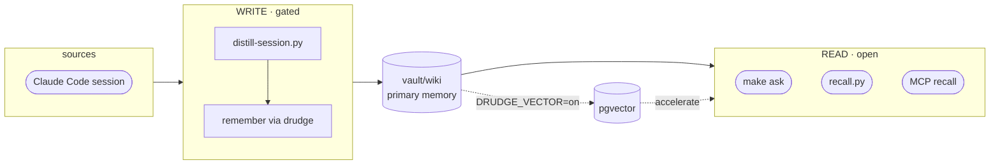

# oh-my-boring

**English** · [한국어](README.ko.md) · [日本語](README.ja.md)

[](https://github.com/jazz1x/oh-my-boring/actions/workflows/ci.yml)


**Self-hosted personal memory RAG.** Your Claude Code sessions are distilled into a local, human-readable wiki and recalled on demand — *"how did I do this last time?"* **Zero cloud · 100% local.**

```bash
git clone https://github.com/jazz1x/oh-my-boring.git ~/oh-my-boring
cd ~/oh-my-boring
make up
make ask Q="how did I fix the docker build cache problem?"
```

> Requires **Docker**, **Ollama** (or any OpenAI-compatible server), **Python 3**, and **jq**.

---

## What it does

1. **Auto-accumulate** — when a session ends, it becomes a curated markdown note in `vault/wiki`. No manual upkeep.
2. **Markdown-first memory** — plain, human-readable, git-diffable notes. Recall reads them directly.
3. **Local-only** — embedding and synthesis run on your machine via Ollama. No external APIs or tokens.

Optional **pgvector** accelerator (`DRUDGE_VECTOR=on`) adds similarity search + GraphRAG when scale calls for it.

---

## Architecture



- **Read door** — fast, no LLM. `make ask`, `recall.py`, MCP `recall` read `vault/wiki` directly.
- **Write door** — gated. `distill-session.py` calls the local LLM and writes through drudge's deterministic `remember` MCP tool.

---

## Configuration

Policy lives in **`boring.json`** (created from `boring.example.json` by `make up`):

| Key | Purpose |
|---|---|
| `note_lang` | `auto` · `ko` · `en` |
| `repos[]` | path/remote rules → `origin=personal/company/mirror/community` |
| `agents[]` | ingest sources for vector mode |

Secrets and runtime switches live in **`.env`**:

| Variable | Purpose |
|---|---|
| `DRUDGE_VECTOR` | `on` enables pgvector (optional) |
| `DRUDGE_LLM_BASE_URL` | OpenAI-compatible endpoint, default `http://localhost:11434/v1` |
| `DRUDGE_LLM_MODEL` / `DRUDGE_EMBED_MODEL` | default `gemma4:12b` / `bge-m3` |
| `SLACK_APP_TOKEN` / `SLACK_BOT_TOKEN` | optional Slack assistant |

---

## Commands

| Command | Description |
|---|---|
| `make up` | set up + start drudge (hermes-agent joins only if its image exists) |
| `make ask Q="..."` | one-shot recall + synthesis |
| `make sync` | deterministic re-ingest of the vault |
| `make remember M="text"` | write a one-line note |
| `make smoke` | end-to-end smoke test |
| `make logs` | drudge logs |
| `make guard` | fmt + clippy + test |
| `make down` | stop containers |

---

## Optional: hermes-agent

hermes-agent (Nous Hermes Agent) is an **optional** supervisor. It can drive Slack, advanced orchestration, and cron-based backfill via drudge's MCP backend. The core loop works without it.

```bash
git clone https://github.com/NousResearch/hermes-agent.git ~/hermes-agent-src
cd ~/hermes-agent-src && docker build -t hermes-agent .
mkdir -p ~/.hermes && chmod 700 ~/.hermes
# register drudge as MCP server in ~/.hermes/config.yaml, then `make up`
```

---

## Deployment

| Mode | How |
|---|---|
| **Docker** (default) | `make up` |
| **Native** | `cd drudge && cargo run --release -- serve` |

---

## Development · guardrails

- SSOT docs: `drudge/{PHILOSOPHY,RUST-STYLE,ENFORCEMENT}.md`
- `make guard` = `rustfmt --check` + `clippy -D warnings` + `cargo test`
- CI: `rust-gate` · `gitleaks` · `cargo-deny` · `trivy`
- `unsafe_code = "forbid"`

---

## Troubleshooting

| Symptom | Fix |
|---|---|
| `make up` fails | Check Ollama: `curl -sf http://127.0.0.1:11434/api/tags` |
| Port conflict | `lsof -i :7700 :5432 :11434` |
| Agent not starting | `OMB_CORE_ONLY=1 make up` runs core-only; hermes image must be built separately |

---

## Directory

```text
oh-my-boring/
├─ drudge/      # Rust engine
├─ hooks/       # host hooks
├─ scripts/     # guard.sh · smoke.sh
├─ vault/       # raw → wiki memory
├─ data/        # Postgres persistence (gitignored)
├─ docker-compose.yml
├─ start.sh
├─ boring.json  # policy (created by make up)
└─ Makefile
```
